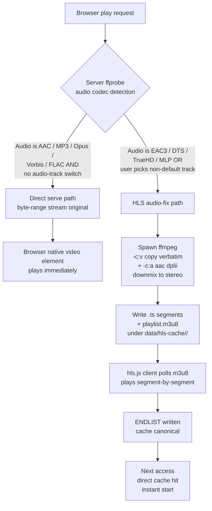
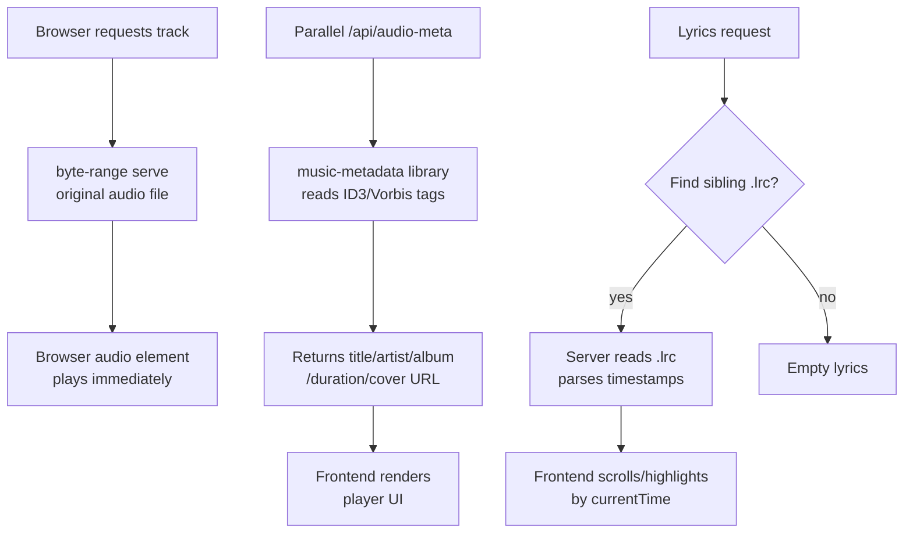
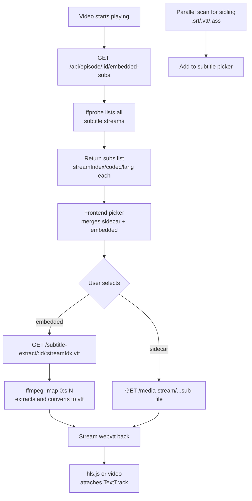

# Chiral Network Channel — Self-hosted Personal Media Library

> Other languages: [中文](./README.zh.md)

A self-hosted private media library that runs on a Synology NAS
or a Windows PC. Any device on your local network (phone, tablet,
TV box browser) can browse and play the videos / audio / images /
novels you have stored.

---

## 📜 Author's Disclaimer

I made this thing for myself, just for fun. You're welcome to
download and use it; happy if you like it — **but if you can't
deploy it, can't get it running, or get stuck somewhere, figure
it out yourself**. I don't offer technical support, and I won't
take issues / emails / DMs asking "why won't it install". If
you've read the entire README and still can't make it work, then
you can't make it work, ***lol***.

> Also, I can't be bothered to maintain separate packages, so if
> the build you grabbed won't run on DSM or whatever other NAS
> you've got, that's normal — porting it is on you.

> I've already done what I can to make the web UI as easy and
> pleasant as possible. If you still find starting / stopping
> the service every time annoying, deal with it.

This project is provided **AS-IS**, with no warranty of fitness
for any particular purpose. **Deploying it means you accept full
responsibility for the consequences.**

---

## ⚠️ READ THIS FIRST — Security Risks & Intended Scope

**This system is for trusted private LANs only. Never expose it
to the public internet.** This isn't paranoia — the project
deliberately ships several design tradeoffs that are inappropriate
for the public web. Read every clause below before deploying;
each one can have severe consequences in a public-facing setup:

### Known risks (intentional design, not bugs)

| # | Risk | Detail |
|---|---|---|
| 1 | **Plaintext password storage** | `data/users.json` stores every user's password in plaintext — no hashing, no salting. Anyone who can read that file gets every account password instantly. |
| 2 | **No HTTPS** | Service runs over plain HTTP. Everything between the browser and the server (passwords, session cookies) travels in cleartext. Same-network packet capture trivially eavesdrops. |
| 3 | **Login rate-limit is in-memory** | Brute-force protection is a memory counter that resets on service restart. |
| 4 | **30-day session lifetime** | Session cookies don't expire for 30 days. Forgetting to log out on a public device leaves a month-long impersonation window. |
| 5 | **Node process runs as NAS admin** | On NAS the Node process inherits `admin` privileges — full read/write across the entire filesystem. |
| 6 | **No CSRF protection** | Cross-site request defense relies solely on cookie SameSite, not full token-based CSRF. |
| 7 | **File upload has no content validation** | Extension filter only; per-file limit is 20 GiB. |

### Intended scope

✅ **OK to use this way:**
- Home router LAN, your devices accessing your NAS
- Fully offline / air-gapped small office network
- Networks where you trust everyone connected

❌ **NEVER use this way:**
- Router with UPnP / DMZ exposing port 8080 to the internet
- DDNS + port forwarding to allow remote access
- Café / hotel / school public Wi-Fi deployments
- Exposed via IPv6 with no IPv6 firewall (most home routers
  don't enable one by default!)
- QuickConnect with a reverse proxy mapping `/` to port 8080

### Three things to verify before deploying

Open your router admin page (usually `192.168.1.1` or
`192.168.0.1`):

```
[ ] 1. UPnP port mapping table — confirm no entries for the NAS IP
[ ] 2. IPv6 settings — confirm firewall is enabled, OR IPv6 is disabled entirely
[ ] 3. Remote management / WAN access — confirm "allow management UI from WAN" is OFF
```

Pass all three before deploying.

---

## What this is

- A **private media web app** for your local network
- Four content kinds: video, audio, images, novels
- Multi-user — each person has independent playback progress,
  favorites, history
- Video transcoding (mkv / avi / mov etc. that browsers can't
  play natively are transcoded on the fly), HEVC / H.265 is
  re-encoded to H.264 automatically, and multi-audio mkvs let
  you switch language from the player settings menu
- Audio supports synced lyrics, album art (ID3 embedded or a
  `cover.jpg` in the folder)
- Zero external dependencies; all data lives on your own disk

---

## Data flow walkthrough (per file format)

Each file format takes a different path from "browser request" to
"content on screen". Understanding the dataflow tells you where
something is stuck, why 1080p HEVC is much slower than 1080p H264,
and why image previews feel snappier than video.

All Mermaid diagrams below render directly on GitHub and in most
Markdown viewers; locally you can use VSCode + Markdown Preview.

### 1. Video (mp4 / mkv / avi / mov / webm / ...)

Video is the **most complex** dataflow because browser support for
codecs varies wildly. The server does an ffprobe up front, then
takes one of two paths (since v1.10.0 the video bitstream is
NEVER re-encoded — see §1b):



**Key points:**

- **Cache key** = `sha1(collectionId | filePath | audioStreamTag)`.
  The same file with different audio tracks caches independently;
  switching back to a previous language hits the cache.
- **Video is always `-c:v copy`** (since v1.10.0): the source
  video bitstream goes into the .ts container untouched, no
  libx264 re-encode. This works around the DS124 ARM A55 taking
  4-5 hours to re-encode a 1080p HEVC feature, in exchange for
  audio-fix transcodes finishing in 5-15 minutes. **The trade-off
  cost** is documented in §1b.
- **Audio is always re-encoded to AAC stereo via dplii matrix**:
  multi-channel sources (EAC3 7.1, DTS 5.1, etc.) go through the
  Dolby Pro Logic II matrix downmix, sidestepping the libavcodec
  auto-downmix zero-matrix silent-output bug on some layouts
  (v1.9.1 fix). PTS is regenerated via `-fflags +genpts` +
  `-avoid_negative_ts make_zero` so seg00000.ts starts at 0 —
  otherwise hls.js disables the audio rendition when audio PTS
  arrives later than video PTS (v1.9.2 fix).
- **RAM-aware scheduling** (since v1.9.0): the server picks a
  tier from the last 5 min of API access + CPU idle. No traffic →
  full tier (threads 3). Traffic with idle CPU → throttle tier
  (threads 2). Traffic with busy CPU → wait tier (no new spawn
  this period). In-flight jobs aren't re-tuned mid-flight when
  wait fires; instead the scheduler SIGSTOPs the process group
  and SIGCONTs once CPU frees up.
- **stdio:ignore + detached:true**: ffmpeg detaches from node,
  so a node restart / deploy doesn't kill it; transcoding
  continues until ENDLIST. After restart the new node's
  `scanOrphanFfmpegs()` walks `ps`, sees the orphan ffmpeg still
  writing into a cache dir, and adopts it into hlsJobs to
  avoid spawning a duplicate.
- **Global concurrency cap of 1** (tightened from 2 in v1.9.0):
  the DS124's real bottleneck is its 1 GB RAM, not CPU. Two
  parallel ffmpeg processes triggered swap thrashing that froze
  the whole NAS.
- **Frontend status adaptation** (since v1.9.3): the server
  responds with `status: 'queued'` / `'transcoding'` to tell the
  client "video not ready yet"; the client shows a toast like
  "queued, position N / M" or "transcoding, segment M done" and
  **never** silently falls back to byte-range native serve
  (otherwise EAC3 would play as a silent video).

#### 1a. MKV transcode queue and trigger UX (v1.10.0 rework)

The DS124's 4-core ARM A55 runs audio-only fix at ~5-10x
realtime (the bottleneck is demux + AAC encode + .ts mux; video
is a copy and consumes no CPU), so a 2-hour movie hits ENDLIST
in 12-24 minutes. First playback still needs to wait for the
first segment (~5-10 s), so **manual pre-enqueue** is still
useful so the admin can prep things ahead of time.

**Two enqueue entry points** (since v1.10.0):

1. **Collection card → Transcode button (detail toolbar)** — opens
   a modal that lists every .mkv under the collection (recursive
   walk). Each row shows: filename / subdir / current HLS cache
   state badge / file size. Five badge states with color coding:
   - 🟢 **Cached** (cache hit with ENDLIST)
   - 🔴 **Cache partial** (cache exists but no ENDLIST — previous
     transcode died mid-way)
   - 🔵 **Queued** (in hlsQueue, not yet spawned)
   - 🟡 **Transcoding** (in hlsJobs, ffmpeg running)
   - gray **Not transcoded** (no cache at all)

   Toolbar has **Select-needed / Select-all / Clear-all** shortcuts.
   Default checked: `not transcoded` + `cache partial`. `cached`
   is unchecked by default (user opts in for re-transcode);
   `queued` / `transcoding` are non-interactive (already in flight).

   **Selecting a cached row + submit** → confirm prompt
   "Re-transcoding will delete the existing cache. Continue?" →
   server-side `killRunningJob(key)` + `hlsQueue.delete` +
   `deleteCacheForKey(key)` three-step cleanup, then re-enqueue.

2. **Bulk-manage → "Pretranscode mkv" button (multi-collection)** —
   inherits the original batch semantics: select multiple
   collections, click once, server walks every .mkv per
   collection, ffprobes to skip files whose audio is already
   AAC/MP3/Opus/Vorbis/FLAC, enqueues the rest. **No modal**,
   pure batch.

```mermaid
flowchart LR
    A[admin clicks<br/>collection card<br/>transcode button] --> M[open transcode-modal<br/>list mkv + status badges]
    M --> M2[tick rows + submit]
    M2 --> B[POST /api/collection/:id/<br/>pretranscode-mkv<br/>body files[] + force]

    A2[admin clicks<br/>bulk-manage<br/>"Pretranscode mkv"] --> B2[POST per collection<br/>no body = batch mode]
    B2 --> B

    B --> F[Add to hlsQueue Map]
    F --> G[Persist to<br/>data/hls-queue.json]
    G --> H[Worker tick every 5s<br/>tickHlsQueue]
    H --> I{Any running<br/>job?}
    I -->|yes| H
    I -->|no| J[Pop oldest pending<br/>spawn ffmpeg<br/>-c:v copy + audio-only]
    J --> K[ffmpeg writes ENDLIST]
    K --> L[hlsQueue.delete<br/>+ persist]
    L --> H
```

#### 1b. ⚠️ Browser video compatibility regression (v1.10.0 trade-off — must read)

Starting with v1.10.0 the transcoder only fixes audio; it no
longer re-encodes video. **Upside**: transcode at 5-10x
realtime, a feature film done in minutes, smaller cache
footprint. **Downside**: whether a source plays in any given
browser is now entirely up to that browser's video decoder
support.

| Source video codec | Safari (mac/iOS) | Edge (Win) | Chromium (recent + HW) | Chromium (old / no HW) | Firefox |
|---|---|---|---|---|---|
| H.264 / AVC | ✓ | ✓ | ✓ | ✓ | ✓ |
| HEVC / H.265 (8-bit) | ✓ | ✓ | ✓ | ✗ | ✗ |
| HEVC / H.265 (10-bit Main10) | ✓ | ✓ | ⚠️ partial | ✗ | ✗ |
| VP9 | ✗ | ✓ | ✓ | ✓ | ✓ |
| AV1 | ✗ | ⚠️ | ✓ (recent) | ✗ | ✓ (recent) |

**TL;DR**:

- **H.264 source** → every browser plays it. No issue.
- **HEVC source** (most modern 1080p / 4K BD-rips and WebRips) →
  only Safari, Edge, and recent Chrome (with HEVC hardware
  decode enabled) play it. **Firefox cannot play it at all**,
  and older Chromium can't either.
- **VP9 / AV1 source** → check [caniuse](https://caniuse.com/)
  for your specific browser / version combination.

**How was this handled before**: in the v1.9.x line libx264 was
re-encoding HEVC to H.264, which played in every browser. But
a 2-hour movie took 4-5 hours of wall time on the ARM A55, and
transcodes often never finished.

**The v1.10.0 trade**: give up universal browser compatibility,
gain transcode completion rate. For a **home NAS use case**
(admin + family, controlled browser set) this is reasonable;
for **public LAN sharing to arbitrary devices** it isn't.

**Workarounds**:

1. Use Safari (macOS), Edge, or Chrome with HEVC support on
   the client.
2. Don't want to switch browsers → re-encode the source on a
   desktop with HandBrake to H.264 1080p AAC stereo, upload the
   cleaned copy. One desktop x86 encode << N ARM retries.
3. **The server has no "force libx264 re-encode" toggle in
   v1.10.0** — could be added later if there's strong demand,
   but isn't there today.

#### 1c. Other source limits (still apply, browser-independent)

A few mkvs trip up even in audio-only mode because the source
file itself is malformed:

- **HDTV rips with residual deinterlacing artifacts**
  (non-integer heights like 1920×1038 / 1920×1078)
- **Unusual frame-rate fractions** (e.g. 500/21, 120000/1001)
- **Multiply-re-encoded / dirty-metadata sources** (filenames
  tagged "V2" / "V3" / "Final" usually fall into this category)
- **Releases with large embedded font attachments (>3 MB)**,
  common in anime / fansub releases — the demuxer still parses
  every stream's metadata, which can spike RAM on a low-memory
  ARM box

**Tested-bad sample (2026-05-10)**:
`Ghost.in.the.Shell.1995.Judgment.V3.1080p.HDTV.x265.HEVC.EAC3-SARTRE.mkv`
— 1920×1038, frame rate 500/21, 6 subtitle tracks, 4 embedded
fonts totaling 3.7 MB. Transcoding it pushes the NAS into swap
thrashing. **This class of source is out of scope**.

**Recommendation**: when you hit one of the above, re-encode it
on a desktop with HandBrake / ffmpeg first (H.264 / 1080p /
23.976 fps / AAC stereo) and upload the cleaned copy. One desktop
encode is faster than N retries on the ARM box.

### 2. Audio (mp3 / m4a / aac / flac / wav / opus / ...)

Browsers handle nearly every audio codec natively, so **no
transcoding is needed** — but the server pre-parses metadata
(ID3 tags, album art, duration) and handles lyrics.



**Cover art lookup order**: (1) ID3/Vorbis embedded image →
(2) `cover.jpg` / `cover.png` / `folder.jpg` in the same folder →
(3) collection default cover → (4) placeholder.

### 3. Images (jpg / png / webp / gif / avif / bmp)

The simplest dataflow: direct serve + thumbnail cache. Manga-
style nested folders are recursively flattened.

```mermaid
flowchart LR
    A[Browser requests collection detail] --> B[/api/collections/:id/tree]
    B --> C[Recursively scan collection dir<br/>incl. subdirectories]
    C --> D[Return episodes list<br/>each image carries thumb URL]
    D --> E[Frontend IntersectionObserver<br/>lazy-loads thumbnails]
    E --> F{Request thumb}
    F -->|first hit| G[ffmpeg generates 256px<br/>thumbnail + caches]
    F -->|cache hit| H[byte-range serve]
    G --> H
    H --> I[Browser img element]
    J[Click thumbnail] --> K[Lightbox shows full-res<br/>byte-range serve]
```

**Manga recursion**: subfolders inside a collection (e.g. per
chapter) are flattened into a single list, but the
`subdir/pageNum` naming is preserved so sort order is intuitive.

### 4. Novels (txt / pdf)

txt and pdf take completely different paths: txt does
server-side encoding detection + chapter splitting, pdf is
rendered client-side by pdfjs.

```mermaid
flowchart TD
    A[Browser requests novel] --> B{File extension}
    B -->|.txt| C[Server chardet<br/>detects encoding<br/>UTF-8/GBK/Big5]
    C --> D[Convert to UTF-8<br/>split by chapter markers<br/>第 X 章 / Chapter X]
    D --> E[Return JSON<br/>chapters: [[title, body],...]]
    E --> F[Frontend renders TOC<br/>+ paged reader]
    B -->|.pdf| G[byte-range serve<br/>raw pdf file]
    G --> H[pdfjs vendor lib<br/>parses + renders client-side]
    H --> I[Canvas page-by-page<br/>zoom/page nav]
```

**txt chapter detection**: regex matches Chinese/English chapter
markers (第 N 章 / Chapter N / Volume N etc.). On no match it
falls back to a single chapter containing the whole file.

### 5. Subtitles (sidecar + embedded)

Subtitles are a side-channel of the video pipeline. **Sidecar**
subs are fetched directly by the frontend; **embedded** subs
are extracted on demand by ffmpeg.



**ASS complex styling**: .ass subs are accepted, but browser
TextTrack only renders basic styling — complex effects (move,
rotate, font swaps) are dropped.

**Sidecar subtitle activation delay**: When you pick a sidecar
subtitle (.srt / .vtt / .ass / .sup ...), the frontend has to
fetch the full subtitle file from the server and let the browser
parse + mount it on `<video>`. Large subs (styled .ass,
Blu-ray-ripped .sup, etc.) can take 1-3 seconds to appear — the
video is already playing but the subtitle hasn't shown up yet.
**This is expected — just wait a few seconds.** Don't rapid-fire
re-pick from the menu (each pick re-fetches and makes it slower).
Embedded subtitles get extracted on demand by server-side ffmpeg,
so their first-mount delay is usually a bit longer; same rule —
be patient.

---

## Choosing a deployment method

| Method | Best for | Difficulty |
|---|---|---|
| **Synology NAS (recommended)** | 24×7 uptime, central NAS storage | Medium (just follow the steps below) |
| **Windows installer** | No NAS; just want to run on a home PC | Easy |
| Windows manual launch | Development / debugging / forking | Medium |

NAS is the canonical setup — configure once, autostarts on boot,
doesn't tie up your PC, plenty of storage.

---

## Method A: Synology NAS deployment (detailed walk-through)

> This walkthrough uses Synology DS124 (DSM 7.3+). Other models
> are identical in DSM. Only CPU architecture (aarch64 vs.
> x86_64) affects which ffmpeg binary you bundle.

### A.1 System requirements

- **NAS model**: any Synology with DSM ≥ 7.0 (DS124 / DS220+ /
  DS920+ / etc.)
- **DSM version**: ≥ 7.0 (7.2 or 7.3 recommended)
- **Free space**: ~200 MB for the project itself; media files
  scale with your library
- **Network**: NAS and your viewing devices must be on the same
  Wi-Fi or LAN

### A.2 Step 1: Enable SSH on DSM

1. Browser → DSM panel: `http://<NAS_IP>:5000/`
2. Sign in with your admin account (**note**: Synology
   disables the literal "admin" username by default — you
   actually log in with whatever administrator name you picked
   when setting up the NAS; we'll keep calling it "admin" for
   short)
3. Top-left **Synology icon** → **Control Panel**
4. Search "terminal", click **Terminal & SNMP**
5. Switch to the **Terminal** tab
6. Check **Enable SSH service**
7. Port number: default is 22, **strongly recommend changing
   it** to something less common (`451`, `2222`, `50022`, etc.)
   — public scanners hammer port 22, a custom port reduces log
   noise. The examples here use `451`
8. **Uncheck** "Enable Telnet service" (telnet is plaintext —
   never use it)
9. Click **Apply**

### A.3 Step 2: Install the Node.js package

1. Control Panel → **Package Center** (or main DSM menu →
   Package Center)
2. Search `Node.js`
3. Find **Node.js v20** or **Node.js v22** (v18 works, v22 is
   faster)
4. Click **Install**, wait a few minutes

> Synology installs Node at `/usr/local/bin/node`, outside the
> default PATH — every script below explicitly adds it.

### A.4 Step 3: Create shared folders

The NAS needs four shared folders for the four content kinds:

1. Control Panel → **Shared Folder** → **Create**
2. Create these four folders in turn:

| Shared folder name | Actual path | Purpose |
|---|---|---|
| `video` | `/volume1/video` | Video files |
| `audio` | `/volume1/audio` | Audio files |
| `Manga` | `/volume1/Manga` | Image collections (manga / photo / etc.) |
| `Novel` | `/volume1/Novel` | Novels (.txt / .pdf) |

3. In each shared folder's permissions, give your admin account
   **read/write**
4. Enable the **Recycle Bin** (recommended — saves you from
   accidental deletes)

> Names must match **exactly** (case included). The scripts
> hardcode these paths.

### A.5 Step 4: Set up SSH key-based login

This lets your computer ssh into the NAS without typing a
password every time.

#### On Windows (Command Prompt)

1. `Win+R` → type `cmd` → Enter to open the command prompt
2. Check whether you already have a key:

   ```
   dir %USERPROFILE%\.ssh\id_rsa.pub
   ```

   - If it says "File not found", continue to generate one
   - If it shows the file exists, skip to "push the public key"

3. Generate a new key (just press Enter at every prompt;
   passphrase can be blank):

   ```
   ssh-keygen -t rsa -b 4096
   ```

4. Push the public key to the NAS:

   ```
   type %USERPROFILE%\.ssh\id_rsa.pub | ssh -p 451 admin@192.168.10.175 "cat >> ~/.ssh/authorized_keys"
   ```

   First time it'll prompt for the NAS admin password. Replace
   `192.168.10.175` with your actual NAS IP and `451` with the
   SSH port you set in A.2.

5. Verify password-less login works:

   ```
   ssh -p 451 admin@192.168.10.175 "echo OK"
   ```

   If it prints "OK" without prompting for a password, you're
   set.

#### On Mac / Linux

```bash
# 1. Check for existing key
ls ~/.ssh/id_rsa.pub

# 2. Generate if missing
ssh-keygen -t rsa -b 4096

# 3. Push to NAS
ssh-copy-id -p 451 admin@192.168.10.175

# 4. Verify
ssh -p 451 admin@192.168.10.175 "echo OK"
```

### A.6 Step 5: Upload the project to the NAS

#### 5.1 Create the application directory

```
ssh -p 451 admin@192.168.10.175 "mkdir -p /volume1/homes/admin/ds124player/data"
```

#### 5.2 Tar the project and stream it over SSH

On your dev machine (Windows), open a command prompt in the
project folder:

```
cd B:\DS124Network
```

Pack the project (excluding development-only folders) and pipe
it through SSH:

```
tar -c --exclude=node_modules --exclude=DevLog --exclude=WinBuild --exclude=runtime --exclude=.git --exclude=server.log --exclude=server.err --exclude=.server.* --exclude=问题资料 --exclude=资源文件管理 --exclude=README . | ssh -p 451 admin@192.168.10.175 "cd /volume1/homes/admin/ds124player && tar -x"
```

> This streams a tar of the project (minus the dev-only
> folders) over SSH into the NAS. First run takes a few
> minutes, depending on your LAN speed.

#### 5.3 Install dependencies

```
ssh -p 451 admin@192.168.10.175 "cd /volume1/homes/admin/ds124player && PATH=/usr/local/bin:\$PATH npm install --production"
```

> `--production` skips dev dependencies. ~1-2 minutes. If
> network errors interrupt it, just rerun (deps come from
> npm's mirror).

#### 5.4 Make the start script executable

```
ssh -p 451 admin@192.168.10.175 "chmod +x /volume1/homes/admin/ds124player/deploy/start.sh"
```

### A.7 Step 6: First start + test

```
ssh -p 451 admin@192.168.10.175 "nohup /volume1/homes/admin/ds124player/deploy/start.sh </dev/null >/dev/null 2>&1 &"
```

> Background-launches the service. First boot scans the media
> library — about 5-15 seconds depending on how much content
> you already have.

Open in your browser: `http://<NAS_IP>:8080/`

If the page loads, you're done. **The first user to register
becomes the administrator**, so register an account immediately
to claim admin status.

### A.8 Step 7 (optional): nginx reverse proxy on port 80

Tired of typing `:8080`? Proxy it onto port 80:

#### 7.1 Upload the nginx config

```
ssh -p 451 admin@192.168.10.175 "cat > /tmp/www.chiral.conf" < B:\DS124Network\deploy\www.chiral.conf
```

#### 7.2 sudo-install into nginx's config dir

```
ssh -p 451 admin@192.168.10.175 "sudo install -m 644 -o root -g root /tmp/www.chiral.conf /etc/nginx/conf.d/www.chiral.conf"
```

> Will prompt for your admin password (sudo).

#### 7.3 Test syntax + reload nginx

```
ssh -p 451 admin@192.168.10.175 "sudo nginx -t && sudo nginx -s reload"
```

After that, `http://<NAS_IP>/` (no port) loads directly.

### A.9 Step 8: Autostart on NAS boot

So the service auto-starts after a NAS reboot:

1. DSM Control Panel → **Task Scheduler**
2. Click **Create** → **Triggered Task** → **User-defined script**
3. **General** tab:
   - Task: `Chiral Network Channel`
   - User: `admin` (or your administrator account)
   - Event: `Boot-up`
   - Enabled: ☑️
4. **Task Settings** tab:
   - User-defined script, paste:

     ```
     /volume1/homes/admin/ds124player/deploy/start.sh
     ```

5. Click **OK**

Test: right-click the task in the list → **Run**, verify it
starts cleanly (it should — we've already started it manually,
this just confirms the path).

### A.10 Daily use / maintenance

#### Adding media files

Drag files via SMB share:

- Windows Explorer: `\\<NAS_IP>\video\`
- Mac Finder: menu → Go → Connect to Server → `smb://<NAS_IP>/video`

Each **subfolder** = one collection. Example:

```
\\NAS\video\
  My Anime\           ← collection "My Anime"
    cover.jpg          ← cover (optional)
    Episode 01.mp4
    Episode 02.mkv
  Movie Bundle\       ← collection "Movie Bundle"
    cover.png
    The Avengers.mp4
```

After adding files, open the site in a browser → admin panel →
Rescan media library (or restart the service). New content
appears.

#### Restart the service

```
ssh -p 451 admin@192.168.10.175 "/volume1/homes/admin/ds124player/deploy/start.sh"
```

> `start.sh` auto-detects and kills any old instance before
> starting a new one — safe to rerun.

#### View logs

```
ssh -p 451 admin@192.168.10.175 "tail -50 /volume1/homes/admin/ds124player/server.log"
```

#### Update code (push a new version)

```
cd B:\DS124Network
tar -c --exclude=node_modules --exclude=DevLog --exclude=WinBuild --exclude=runtime --exclude=.git --exclude=server.log --exclude=server.err --exclude=.server.* --exclude=问题资料 --exclude=资源文件管理 --exclude=README . | ssh -p 451 admin@192.168.10.175 "cd /volume1/homes/admin/ds124player && tar -x"
ssh -p 451 admin@192.168.10.175 "/volume1/homes/admin/ds124player/deploy/start.sh"
```

If you only changed frontend files (`public/*.js / .css /
.html`), browser hard-reload (`Ctrl+Shift+R`) is enough — **no
service restart needed**.

---

## Method B: Windows local deployment

> ⚠️ **Method B is an EXPERIMENTAL deployment path**
>
> The mainstream deployment for this project is Method A (Synology
> NAS); Method B was added later as a convenience for people
> without a NAS who want to try the player. Running Windows as a
> home server pulls in firewall rules, UAC, third-party security
> products, power management, network profile classification, and
> more — every one of those is "non-existent on a NAS but
> step-on-able on Windows."
>
> **Choosing Method B means you also accept the following:**
>
> | # | Method-B-specific risk | Detail |
> |---|---|---|
> | B-1 | **Mandatory Windows-Firewall changes** | Launcher's [A] disables legacy `node.exe` Block rules and adds a `Profile=Any` inbound Allow rule. The Allow rule is also active on Public Wi-Fi; the disabled Block rules affect every Node project on this PC. Run [R] before joining an untrusted network |
> | B-2 | **Third-party security software adds another layer** | Huorong / 360 / Norton / Kaspersky etc. run their own network filtering below Windows Firewall and the launcher cannot reach them. If a phone still cannot connect, you must allow `node.exe` in that product manually |
> | B-3 | **PC sleep / shutdown stops the service** | A NAS runs 24/7; a desktop / laptop does not. Sleep, lock-screen, or shutdown takes the service down |
> | B-4 | **Storage is your PC drive** | Media, users, progress all live in `Resource/` and `data/`. No RAID, no snapshots, no NAS-style hot/cold tiering. Drive failure = your watch history goes with it |
> | B-5 | **Multi-client / heavy concurrency untested** | Core code is validated on a NAS with single ARM-A55 1.7GHz / 1GB RAM. PCs are far stronger but no formal load testing for many simultaneous clients was done. 2-3 phones at home is fine; more, no guarantee |
> | B-6 | **Upgrade / repair only covers the one-click installer** | Manual / source-code installs are on you (`git pull` + restart) |
>
> **The author accepts no responsibility for problems with Method B
> deployments** — including but not limited to: same-LAN attacks
> after opening firewall, password leaks, media file loss, service
> auto-restart failure, third-party security product interference,
> sluggish PC. Full disclaimer is in the "📜 Author's Disclaimer"
> and "⚠️ READ THIS FIRST" sections at the top of this document.
>
> **For problems, see §B.7 below — known pitfalls and fixes.**

### B.1 One-click installer (easiest)

1. Get the `ChiralNetworkChannel-Setup-X.X.X.exe` installer
2. Double-click and follow the prompts (default install path is
   fine)
3. Desktop shortcut appears after install
4. Double-click to launch — browser opens
   `http://localhost:8080/` automatically
5. Register the first account → automatic admin

#### Where do media files go

Inside the install folder:

```
<install_path>\Resource\media\<collection>\<video file>
<install_path>\Resource\audio\<collection>\<audio file>
```

`<install_path>` defaults to
`%LOCALAPPDATA%\Programs\Chiral Network Channel\`.

### B.2 Manual launch (need Node.js installed yourself)

If you don't have the installer and want to run from source:

1. Install Node.js v20 or v22 ([nodejs.org](https://nodejs.org))
2. Open a command prompt in the project folder:

   ```
   cd B:\DS124Network
   ```

3. Install deps:

   ```
   npm install
   ```

4. Run:

   ```
   node server.js
   ```

5. Browser → `http://localhost:8080/`

`Ctrl+C` to stop.

### B.3 Letting phones / tablets on the same LAN connect

**One-stop flow** (5 steps, ~30 seconds the first time):

1. Double-click `ChiralNetworkChannel.bat` (or use the installer's
   desktop shortcut)
2. Wait for the LAN URL list. One row will be tagged `[WLAN]` /
   `[Wi-Fi]` / `[Ethernet]` — **note that URL**
3. Read the security notice the launcher prints (also reproduced
   in §B.3.2 below), then type **`A`** + Enter
4. UAC prompt appears (the dimmed-screen Windows dialog) →
   click **Yes**
5. Wait for **`VERIFY OK -- LAN access is now configured`** in
   the log. Connect your phone to the same Wi-Fi, paste the URL
   into a browser

**That's it.** On subsequent launches the rule is still in place,
so press `N` to skip the firewall step (unless you ran `R` to
revert it).

#### B.3.1 What the launcher does (read before pressing `A`)

When you type `A`, the launcher does two things with admin rights
(via UAC):

1. **Cleans up legacy Block rules**: every Windows-Firewall popup
   you ever clicked "Don't Allow" / "Cancel" on for a Node project
   left behind a Block rule. Multiple projects accumulate a stack
   of identically-named `Node.js JavaScript Runtime` Block rules.
   **Block has higher precedence than Allow** in Windows Firewall,
   so those Block rules silently override the port Allow rule we
   add — the typical symptom is "phone can ping the PC but TCP to
   8080 times out." The launcher disables (NOT deletes; reversible)
   every such rule and writes the disabled list to
   `lib/firewall-state.json` so `R` can undo precisely.

2. **Adds the Allow rule**: a single inbound TCP `<port>` Allow
   rule named `Chiral Network Channel <port>` with **Profile=Any**
   (covers Private + Public + Domain, sidesteps the common failure
   mode where Wi-Fi was tagged "Public" by Windows and a
   Private-only rule never matches).

When you type `R` later:

1. Removes the `Chiral Network Channel <port>` Allow rule
2. Reads `lib/firewall-state.json` and re-enables exactly the
   Block rules `A` had disabled
3. Deletes the state file

#### B.3.2 Security / risk disclosure

Informed consent items before pressing `A`:

- **Who can connect**: any device that can ping your PC on the
  same LAN can attempt `http://<your-IP>:8080/`. Login is
  required (no token = no access), but **passwords are stored in
  plaintext** (single-user / family scope by design; no bcrypt /
  argon2). Don't share LAN access with strangers.
- **`-Profile Any` opens you up on PUBLIC Wi-Fi too**: in cafes,
  airports, hotels, shared apartment Wi-Fi, your port 8080 is
  also reachable from anyone on the same network. **Before
  joining an untrusted Wi-Fi, run the launcher and press `R`**.
  `R` is idempotent — pressing it multiple times has no
  side-effect.
- **Block-rule disable is global to this PC**: `A` disables every
  `node.exe` inbound Block rule, **not just for this app**. Other
  Node projects you previously denied Public-network access to
  become reachable until you press `R`.
- **Third-party security software adds another layer**: Huorong,
  360, Norton, Comodo, Kaspersky etc. run their own network
  filtering below Windows Firewall — `A` does not affect them.
  If a phone still cannot connect after `A`, allow `node.exe`
  inbound in that product manually (see §B.7.4).

#### B.3.3 Sample launcher output

```
============================================================
  Chiral Network Channel - service started on port 8080
============================================================

  Local access:
    http://localhost:8080/

  LAN access (phones / tablets on the same Wi-Fi):
    http://192.168.1.10:8080/    [WLAN]
    http://192.168.1.42:8080/    [Ethernet]   (multi-NIC → multiple URLs)

  Service runs in the background; closing this window does NOT
  stop it. To stop the service, run shutDown.bat.

============================================================
  Security notice -- read before choosing [A]
============================================================
  ... (content described in §B.3.2 above) ...
============================================================

  Firewall (type N if unsure):
    A = Allow phones on this LAN (one-stop: cleanup + Allow rule, asks UAC)
    R = Restore previous state (re-enable Block rules, drop Allow, asks UAC)
    N = No change

Type A, R, or N then press Enter:
```

The bracketed tag after each URL is the Windows interface alias
(`WLAN`, `Wi-Fi`, `Ethernet`, ...). The list uses
`Get-NetAdapter -Physical` to filter, automatically excluding
VPN adapters (WireGuard / OpenVPN / TAP), virtualization (Hyper-V
/ WSL / vEthernet), Bluetooth PAN, etc. — so you won't see
something like `10.7.0.2` (a VPN tunnel address) and mistake it
for a LAN IP.

#### B.3.4 Known LAN HTTP limitations

Phones reach the server over `http://<IP>:8080/`, which browsers
don't treat as a secure context (HTTPS or localhost only). A few
APIs degrade:

- Service Worker registration fails → loses offline caching;
  video playback, subtitles, login etc. unaffected
- Auto gravity-flip detection silently no-ops → use the manual
  "flip screen" button on the player controls bar
- Document Picture-in-Picture (audio in a separate window) fails
  → falls back to standard in-page mini-player

Unlocking all APIs requires HTTPS on the local PC (mkcert self-
signed + a one-time browser trust, or Caddy / nginx reverse
proxy). Out of scope for this README.

### B.4 Stopping the service

- Installer build: double-click `shutDown.bat`
- Manual: `Ctrl+C` in the command prompt

> **Note**: pressing any key in the LAN-IP launcher window from
> §B.3 only **closes the window**. The hidden node process keeps
> running. To actually stop the service run `shutDown.bat`.

### B.5 Reset accounts / data

- Installer build: double-click `reset.bat` (**deletes all
  users, progress, comments, but NOT media files**)
- Manual: delete the `.json` files in `data/`, restart the
  service

### B.6 Upgrading to a newer version / repairing a broken install

**Upgrading**: when you get a new
`ChiralNetworkChannel-Setup-X.X.X.exe`, **just double-click
it**. The installer will automatically:

1. Detect the existing installation (via a fixed AppId, not
   tied to version number)
2. Pre-fill the install-path field with the existing location
   (doesn't install to a different place)
3. If the service is running, pop up a "Please close the
   following applications" dialog — tick "Automatically close
   the applications" and Windows will stop the service for you
4. Overwrite all program files, **leaves `data/` and `Resource/`
   untouched** (your accounts, playback progress, media library
   are safe)

**No need to uninstall the old version first**.

**Repairing a broken install**: if program files (`app.js`,
`lib/`, `vendor/`, etc.) get accidentally deleted or corrupted,
**rerun the same-version (or newer) setup.exe**. Every file
under `[Files]` carries the `ignoreversion` flag, so it gets
overwritten — equivalent to a full reinstall. `data/` and
`Resource/` still aren't touched.

> If the data files themselves are corrupted
> (`data/users.json` malformed, service won't start), see the
> "Forgot the admin password" section earlier — delete the
> JSON files under `data/` and the service will rebuild.

### B.7 Troubleshooting (Windows-deployment pitfalls)

In rough frequency order:

#### B.7.1 ICMP works but TCP times out (**most common**)

**Symptom**: phone can ping the PC (PowerShell `ping <phone-IP>`
succeeds both ways) but a browser hitting `http://<PC-IP>:8080/`
spins forever and times out (note: timeout, NOT "connection
refused").

**Root cause**: leftover `Node.js JavaScript Runtime` inbound
Block rules in Windows Firewall. Every time a Windows-Firewall
popup over the past few years asked "Allow / Cancel" for a Node
project, clicking "Cancel" or "No" left a Block rule. Over many
projects you accumulate a stack — and **Block precedence is
higher than Allow** in Windows Firewall, so the new port Allow
rule we add gets overridden.

**Fix**: launcher 1.7.47+ handles this automatically — run the
launcher and press `A`. After UAC, the log will show
`Disabled N rule(s)` followed by `VERIFY OK`. **You don't need
to dig through Windows Firewall manually.**

If you're on an older version:
- Run as admin: `B:\DS124Network\lib\firewall-rule.ps1 -Action Add -Port 8080`
- Or open `wf.msc` (Win+R → type) → Inbound Rules → sort by
  Action column → find Block-rule entries named
  `Node.js JavaScript Runtime` → disable them all

#### B.7.2 Selecting `[A]` causes a console flash and the launcher window closes

**Symptom**: in the launcher you type `a` + Enter, see a
PowerShell black window flash for an instant, then the launcher
window itself disappears.

**Root cause**: pre-1.7.45 bat used a nested
`powershell -Command "Start-Process powershell -Verb RunAs ...\"...\""`
form. cmd.exe parsing the nested `\"` ends the outer quote
early; the embedded `|` characters become cmd-level pipes,
breaking the line into a 3-stage broken pipeline.

**Fix**: upgrade to 1.7.46+, which calls a separate
`lib/firewall-rule.ps1` instead of building a nested one-liner.

#### B.7.3 No UAC prompt appeared

**Symptom**: log shows `Requesting administrator privileges...`
followed by `elevated child returned`, but you never saw a UAC
prompt.

**Possible causes**:
1. UAC popup got hidden by another fullscreen app or showed on a
   secondary monitor — check the taskbar shield icon for a flash
2. UAC is set to "Never notify" (silently grants without
   prompting) — in this case elevation actually succeeded
3. The path contains quotes / spaces causing the elevated child
   to crash on launch — fixed in 1.7.47+

**Fix**: check `lib/firewall-rule.log` for a `VERIFY OK` line —
if present, the rule is in place regardless of whether you saw
the UAC prompt. If absent:
- Right-click `ChiralNetworkChannel.bat` → "Run as administrator"
  — the whole launcher then runs elevated and `[A]` won't need a
  second elevation hop.

#### B.7.4 Third-party security software is blocking inbound

**Symptom**: `[A]` completes + log shows `VERIFY OK` + no
leftover Block rules, **but the phone still can't connect**
(timeout or connection reset).

**Root cause**: Huorong (火绒) / 360 / Norton / Comodo /
Kaspersky etc. run their own network filtering below Windows
Firewall and the launcher cannot affect them.

**Fix**: open the security product's UI:

- **Huorong 6.x**: Main → Protection Center → Network Extension
  Protection → Network Access Rules → find the `node.exe` entry →
  set to "Allow", or add a rule allowing
  `<install-path>\runtime\node.exe` inbound TCP 8080
- **Huorong 5.x**: Main → Protection Center → System Protection
  / Network Access Control
- **360 Total Security**: Main → Protection Center → Traffic
  Firewall / Network Connection Monitor → Application Rules →
  set `node.exe` to "Allow"
- **Norton**: Settings → Firewall → Program Control → find
  `node.exe` → Access = Allow All
- **Comodo**: Firewall → Application Rules → `node.exe` → Allow

If you have no third-party security software and still can't
connect, see §B.7.5.

#### B.7.5 LAN URL list contains weird IPs (10.7.0.x / 172.x.x.x)

**Symptom**: launcher's LAN URL list contains entries like
`http://10.7.0.2:8080/` with bracket tags like `[Ethernet 2]` /
`[Local Area Connection 2]`.

**Root cause**: WireGuard / OpenVPN / TAP-Windows / similar VPN
adapter that registered as an Ethernet-class adapter. That IP is
a VPN tunnel address — **phones cannot reach it**.

**Fix**: 1.7.46+ filters via `Get-NetAdapter -Physical` and
automatically excludes virtual adapters. If you still see them,
upgrade. **The URL the phone should connect to is the one tagged
`[WLAN]` / `[Wi-Fi]` / `[Ethernet]` (no number suffix)** —
typically a `192.168.1.x` / `192.168.10.x` / `10.0.0.x` address
from your home router DHCP.

#### B.7.6 Router AP isolation / client isolation

**Symptom**: phone has internet (so Wi-Fi connection itself is
fine) but can't ping the PC and can't reach the LAN URL.

**Root cause**: router has "AP Isolation" / "Client Isolation"
/ "Guest Network" enabled, which prevents devices on the same
Wi-Fi from talking to each other. Home router guest SSIDs
typically default this on.

**Fix**:
- Log into the router admin (usually `192.168.1.1` or
  `192.168.0.1`; credentials on the router's bottom sticker) →
  find "AP Isolation" / "Client Isolation" / similar toggle →
  turn it off
- Or: don't connect the phone to a guest SSID; use the main one
- Dual-band routers with separate 2.4G/5G SSIDs and "band
  isolation" enabled also trigger this — put both phone and PC
  on the same band

#### B.7.7 Multiple Wi-Fi adapters on the PC (virtual + physical)

**Symptom**: launcher shows two `[WLAN]` URLs; the phone works
with one but times out on the other.

**Root cause**: VirtualBox / Hyper-V / Docker Desktop creates
virtual wireless adapters. `Get-NetAdapter -Physical` usually
filters them out, but some products' virtual adapters claim
Physical=true.

**Fix**: try both URLs from the list — one is the real Wi-Fi.
Long-term solution: disable the virtual adapter (Control Panel
→ Network Connections → right-click → Disable).

#### B.7.8 Service won't start / port in use

**Symptom**: launcher gets stuck on
`waiting up to 15s for /api/health` and eventually times out.
`server.err` or `server.log` shows `EADDRINUSE`.

**Root cause**: port 8080 is occupied by another program
(commonly: stale Node from a previous unclean shutdown, IIS,
SQL Server Reporting Services, Skype legacy).

**Fix**:
- Launcher's port-fallback chain auto-tries 8081, 8088, 8888,
  9090, ... — so the LAN URL list may show a different port.
  **Use the port the list actually shows**.
- Kill the offending process: `netstat -ano | findstr :8080`
  → note the PID → Task Manager → end task
- Run `shutDown.bat` once to clean up any leftover Node

#### B.7.9 Before joining an untrusted Wi-Fi

**This is a required step**: the launcher's Allow rule is
`Profile=Any`, meaning your port 8080 is also exposed on cafe /
airport / hotel / shared-apartment Wi-Fi.

**Fix**: double-click `ChiralNetworkChannel.bat` → type `R` +
Enter → accept UAC. This will:
1. Remove the Allow rule
2. Re-enable the Block rules `[A]` had disabled
3. Delete `lib/firewall-state.json`

When you're back on a trusted network, press `A` again. `R` is
idempotent — pressing it multiple times has no side-effect.

---

## Customizing themes and UI language

The bundled UI ships with:
- Three themes: dark / light / Division (an ISAC HUD-styled
  theme with scanline + falling snow effects)
- Three languages: Simplified Chinese / English / Traditional
  Chinese

To add your own theme or translation, see
`CustomTemplate/Tutorial/`:

- English: `CustomTemplate/Tutorial/TUTORIAL.en.md`
- Chinese: `CustomTemplate/Tutorial/TUTORIAL.zh.md`

The tutorials cover:
- New theme scaffold + meaning of every CSS variable
- New locale template + recommended max length per key
- Deployment flow + per-field reference

Adding a new theme/locale **doesn't require any JS edits** —
drop a file + add one line in `index.html` to register.

---

## Troubleshooting

### The browser says "Not Secure" / "Not Private" in the address bar

**What you see**: open `http://<NAS-IP>/` or `http://localhost:8080/`
and the address bar shows a small icon plus the words "Not Secure"
(Chrome / Edge), a crossed-out padlock (Firefox), or "Not Encrypted"
(Safari). Some browsers also pop up a bigger red warning the moment
you type your password.

**Is this a bug**: no. **You don't need to fix it, and you can't
fix it inside the scope of this project.**

**In plain English**:
- URLs start with one of two things — `http://` (no s) or `https://`
  (with s).
- Modern browsers label **every** `http://` site as "Not Secure".
  Only `https://` sites (which carry a "certificate" issued by a
  trusted authority) get the green / locked "Secure" label.
- This project runs over plain `http://` and has no certificate
  installed, so the browser warns you **every time**. It has
  nothing to do with whether your password is strong or whether the
  service has bugs — it's purely "you didn't put the certificate
  sticker on."

**So is it actually dangerous**:
- Using it on **your own home Wi-Fi** → fine. The warning is aimed
  at people who use http sites on public Wi-Fi.
- Using it on **café / hotel / school / shared-apartment Wi-Fi** →
  **genuinely dangerous**. Anyone else on the same Wi-Fi can in
  theory run a packet sniffer and see your login password
  (because http transmits everything as plain text). This is
  exactly why the "READ THIS FIRST" section at the top of this
  document keeps insisting "do not expose to the public internet,
  do not use on untrusted Wi-Fi."

**Can I make the warning go away**: yes, but you have to set it up
yourself — this project doesn't ship it:
- Quick local fix: use the `mkcert` tool to generate a self-signed
  certificate for your machine, then import it into your browser's
  trust store. After that `https://<NAS-IP>/` shows a padlock.
  (You'd have to import it on every device that you want to access
  from.)
- The proper way: buy a domain + register it publicly + get a free
  Let's Encrypt cert + nginx reverse proxy. But that means putting
  the service on the **public internet**, which directly contradicts
  the "never expose to the public internet" rule at the top of the
  document. **Not recommended.**

**Bottom line**: when you see "Not Secure", **don't panic** — it's
fine at home; just don't log in over public Wi-Fi. Getting rid of
the warning entirely requires setting up HTTPS yourself, which is
out of scope for this project.

### Video keeps spinning, never starts

That format needs server-side transcoding (`.mkv`, `.avi`,
etc.). Check whether ffmpeg is in place on the NAS:

```
ssh -p 451 admin@192.168.10.175 "ls -la /volume1/homes/admin/ds124player/bin/ffmpeg/linux-arm64/"
```

You should see `ffmpeg` and `ffprobe`, both executable. If
they're missing or non-executable:

```
ssh -p 451 admin@192.168.10.175 "chmod +x /volume1/homes/admin/ds124player/bin/ffmpeg/linux-arm64/*"
```

### HEVC / 10-bit videos take a long time before the first frame

The DS124's ARM A55 software-encodes libx264 at roughly 0.4-
0.5x realtime, so a 1080p HEVC source needs about 10-20 seconds
of buffering before playback can start. The player shows
"音频转换准备中…" while this happens. ffmpeg keeps writing
segments in the background after that, and any region the
progress bar already covers can be seeked to immediately.
Reopening the same file later hits the cache and starts
instantly.

### Switching audio track on a multi-audio mkv pauses briefly

Switching audio = restarting the HLS pipeline with the new
audio stream. Each language has its own cache, so the first
switch into a language costs 5-15 seconds (H.264 source) or
10-20 seconds (HEVC source); subsequent switches back to that
language are instant. The player preserves the current play
position and resumes after the new pipeline is ready.

### I uploaded files via SMB but they don't show up on the website

Not a bug. The system doesn't watch the filesystem. Either:
- **Sign in as admin** → top menu → Admin Panel → Rescan
  media library
- Or restart the service

### Audio has a `.lrc` file but no lyrics show

Verify:
1. Lyric filename = audio filename (only the extension
   differs)
2. Both files **in the same folder**
3. `.lrc` timestamps follow the standard `[mm:ss.xx]` format

### Forgot the admin password

NAS:
```
ssh -p 451 admin@192.168.10.175 "rm /volume1/homes/admin/ds124player/data/users.json && /volume1/homes/admin/ds124player/deploy/start.sh"
```

Windows installer: double-click `reset.bat`

⚠️ **This deletes all users, progress, comments**, but media
files are untouched. Then re-register; the first user becomes
admin again.

### Port 8080 is taken by another program

NAS: edit the `export PORT=8080` line in `deploy/start.sh`.

Windows: edit the equivalent in `ChiralNetworkChannel.bat`, or
at runtime:

```
set PORT=8088
node server.js
```

### Service won't start / exits immediately

Check the error log:

```
ssh -p 451 admin@192.168.10.175 "tail -50 /volume1/homes/admin/ds124player/server.err"
```

Most common causes:
- Port already in use (change port or kill the offender)
- `npm install` was never run, or deps are corrupted (rerun
  `npm install`)
- Shared folder paths wrong (the four folders in A.4 must all
  exist with the exact names)

---

## What's in this repository

The shipping release contains:

| Folder / file | Purpose |
|---|---|
| `public/` | Frontend (HTML / CSS / JS) — what the browser loads |
| `lib/` | Backend Node.js business modules |
| `bin/ffmpeg/` | Statically compiled ffmpeg binaries (per-platform subfolders) |
| `data/` | Runtime data (users / progress / comments JSON) — auto-created on first start |
| `deploy/` | NAS deployment scripts + nginx config |
| `CustomTemplate/` | Theme / language customization templates + bilingual tutorials |
| `README/` | This documentation (this file + Chinese version) |
| `icon/` | Icon assets |
| `server.js` | Node service entrypoint |
| `config.js` | All configuration knobs (env vars override) |
| `package.json` | npm dependency manifest |
| `version.json` | Current version (single source of truth) |
| `*.bat` | Windows launch / stop / reset scripts |
| `runtime/` | (Optional) Bundled Node runtime for the Windows installer build |

---

## Configuration (environment variables)

Most users never touch this. When you do, add `export` (NAS) or
`set` (Windows) lines to `start.sh` or `ChiralNetworkChannel.bat`:

| Variable | Default | Meaning |
|---|---|---|
| `PORT` | `8080` | HTTP listen port |
| `HOST` | `0.0.0.0` | Listen address (`127.0.0.1` = local-only) |
| `MEDIA_ROOT` | `/volume1/video` (NAS) / `./Resource/media` (Win) | Video root |
| `AUDIO_ROOT` | `/volume1/audio` / `./Resource/audio` | Audio root |
| `IMAGE_ROOT` | `/volume1/Manga` / `./Resource/image` | Image collection root |
| `NOVEL_ROOT` | `/volume1/Novel` / `./Resource/novel` | Novel root |
| `DATA_ROOT` | `./data` (under app dir) | User/progress/comment JSON dir |
| `SESSION_TTL_MS` | `2592000000` (30 days) | Session lifetime in ms |
| `FFMPEG_PATH` | autodetect | Explicit ffmpeg binary path |

---

## Versioning

The version lives in one place: `version.json`. Frontend, backend,
and installer all read from it.

| Position | Meaning |
|---|---|
| MAJOR (1.x.x) | Major architecture change (owner-bumped only) |
| MINOR (x.7.x) | New features |
| PATCH (x.x.8) | Fixes / tweaks |

After every deploy, check the `version` field in `version.json`
matches what's on the NAS — easy sanity check.

---

## What this README intentionally omits

Some folders are development artifacts and are **not part of the
shipping runtime**, so they aren't documented here:

- `DevLog/` — project development log (private record, not
  deployed)
- `WinBuild/` — Windows installer packaging scripts (project
  maintainer only)
- `资源文件管理/`, `问题资料/` — maintainer's auxiliary
  documentation folders

When deploying to NAS, those folders are skipped via
`tar --exclude=...`, so they never reach production.

---

## License & disclaimer

This is a personal project. No license, no commercial support.
The author assumes **no liability** for any data loss, privacy
incident, or security event arising from your use of this
software. **Deploying it implies you've read and understood
every clause in the "READ THIS FIRST" section above**.
