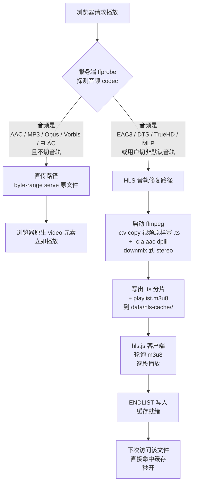

# Chiral Network Channel — 自托管私人媒体库

> 其他语言：[English](./README.en.md)

一套自托管的私人媒体库，运行在 Synology NAS 或 Windows 电脑
上，让局域网内任何设备（手机 / 平板 / 电视盒子的浏览器）都能
浏览和播放你存的视频、音频、图片、小说。

---

## 📜 作者免责声明

这东西我自己做着玩的。你下了你要用我没意见，喜欢的话我
很高兴 — **但如果你部署不出来、跑不起来、卡在哪一步，自己
想办法解决**。我不提供技术支持，也不接 issue / 邮件 / 私信问
"为什么我装不上"。如果你看完整套 README 还是搞不定，那就搞不定吧
，***嘻嘻***。

> 另外我懒得专门分开打包了，所以如果你拿到的包如果不能在DSM或者别的什么NAS系统上运行是正常的，建议自己动手做适配

> 我已经竭尽所能的把网页做的好用简单了，如果你觉得每次开关服务太麻烦了，受着

本项目以 **AS-IS（按现状提供）** 提供，不保证任何特定用途的
适用性。**部署即代表你接受所有后果自负。**

---

## ⚠️ 使用前必读 — 安全风险与适用范围

**本系统仅供受信任的私有局域网使用，绝对不要暴露到公网。** 这
不是过度担心 — 项目从设计上就有意做了多个不适合公网的取舍。
继续部署前请通读以下条款，每一条都可能在公网环境下导致严重
后果：

### 已知风险（设计上有意为之，不会修复）

| # | 风险 | 详情 |
|---|---|---|
| 1 | **明文密码存储** | `data/users.json` 直接以明文存储所有用户密码，无哈希、无加盐。任何能读取该文件的人立即拿到所有账号密码 |
| 2 | **无 HTTPS** | 服务跑在纯 HTTP 上，浏览器 ↔ 服务器之间所有数据（含密码、Session Cookie）以明文传输。同网段抓包即可窃听 |
| 3 | **登录限速可被重启绕过** | 暴力破解保护是内存计数，重启服务即归零 |
| 4 | **Session 30 天有效** | 登录后 Cookie 30 天不过期；公共设备登录后忘记登出，他人可在一个月内冒用 |
| 5 | **Node 进程以 admin 身份运行** | NAS 上 Node 进程拥有 `admin` 最高权限，对整个 NAS 文件系统有读写权 |
| 6 | **无 CSRF 保护** | 跨站请求保护仅靠 Cookie SameSite，不是充分防御 |
| 7 | **文件上传无内容校验** | 仅按扩展名过滤，单文件 ≤ 20 GiB |

### 适用场景

✅ **可以这样用**：
- 家里的路由器内网，自家设备访问自家 NAS
- 完全离线 / 物理隔离的小型办公室局域网
- 信任所有连接到该网络的人

❌ **绝对不要这样用**：
- 路由器开 UPnP / DMZ 把 NAS 8080 端口暴露到公网
- 配置 DDNS + 端口转发让外网能访问
- 在咖啡馆 / 酒店 Wi-Fi / 学校公共网络部署
- 暴露在 IPv6 公网（很多家用路由器默认不开 IPv6 防火墙！）
- 通过 QuickConnect 把根路径反代出去

### 部署前自查三件事

打开你的路由器管理页（通常是 `192.168.1.1` 或 `192.168.0.1`）：

```
[ ] 1. UPnP 端口映射表 —— 确认没有 NAS IP 的条目
[ ] 2. IPv6 设置 —— 确认防火墙已启用，或 IPv6 完全关闭
[ ] 3. 远程管理 / WAN 访问 —— 确认 "允许从 WAN 访问管理界面" 已关闭
```

三项全过才动手部署。详细的"风险路径"分析见本文末尾。

---

## 这是什么

- 局域网内的**私人媒体网站**，浏览器打开就能看
- 支持四种内容：视频、音频、图片、小说
- 多用户，每个人有独立的播放进度、收藏、历史
- 视频支持转码（mkv/avi/mov 等浏览器不能直接播的格式自动转），HEVC/H.265 自动重编码到 H.264，多音轨 mkv 可在播放器设置里切换语言
- 音频支持歌词同步、专辑封面（ID3 内嵌或目录里的 cover.jpg）
- 全程零依赖外网，所有数据都在你自己的硬盘上

---

## 数据流详解（不同文件格式的处理路径）

每种文件格式从「浏览器请求」到「内容到达屏幕」走的路径不一样。理解
这套数据流能帮你判断卡在哪一步、为什么 1080p HEVC 比 1080p H264
慢得多、为什么图片预览比视频丝滑。

下图所有 Mermaid 图在 GitHub / 大多数 Markdown 阅读器里能直接渲染；
本地用 VSCode + Markdown Preview 也能看。

### 1. 视频（mp4/mkv/avi/mov/webm/...）

视频是项目里**最复杂的**数据流，因为不同 codec 浏览器支持度天差地别。
服务端先 ffprobe 探测，然后走两条路径之一（v1.10.0 起视频比特流永
远不再重编码 — 详见 §1b）：



**关键点**：

- **缓存键** = `sha1(collectionId | filePath | audioStreamTag)`。同一文件
  的不同音轨独立缓存，切回某语言走静态命中。
- **视频永远 -c:v copy**：v1.10.0 起源视频比特流原样进 .ts 容器，不再
  跑 libx264。这是为了避开 DS124 ARM A55 重编码 HEVC 慢的硬伤（一部
  电影 4-5 小时），换来音轨修复在 5-15 分钟内完成。**代价**见 §1b。
- **音频永远走 AAC stereo + dplii 矩阵**：EAC3 7.1 / DTS 5.1 等多声道
  源经 Dolby Pro Logic II 矩阵 downmix 到 stereo，绕过 libavcodec
  自动 downmix 在某些 layout 上落到零矩阵的静音 bug（v1.9.1 修法）。
  PTS 用 `-fflags +genpts` + `-avoid_negative_ts make_zero` 强制从 0
  起，防 hls.js 因「audio 起点比 video 晚」disable 音轨（v1.9.2 修法）。
- **RAM-aware 调度（v1.9.0 起）**：服务端按 5 分钟 API 心跳 + CPU idle
  判定 tier，无人访问 → full（threads 3），有人访问 + CPU 空闲 →
  throttle（threads 2），有人访问 + CPU 紧张 → wait（本周期不启新
  任务）。运行中任务命中 wait 时不改 threads，而是 SIGSTOP 进程组冻结，
  CPU 释放后 SIGCONT 唤醒。
- **stdio 全 ignore + detached:true**：ffmpeg 进程脱离 node，node 重启
  / 部署不会带走它，转码继续到 ENDLIST。新 node 启动后 `scanOrphan
  Ffmpegs()` 扫 ps 把仍在跑的 ffmpeg adopt 进 hlsJobs，避免重复 spawn。
- **全局并发上限 1**（v1.9.0 收紧自原 2）：DS124 真正瓶颈是 1GB RAM
  不是 CPU，并发 2 路 ffmpeg 会触发 swap thrashing 导致整台 NAS 卡死。
- **前端 status 适配（v1.9.3 起）**：服务端用 `status: 'queued'` /
  `'transcoding'` 告诉前端「视频还没准备好」，前端 toast 提示「视频排队
  中第 N 位」/「视频转码中已完成 M 段」，**绝不** 静默 fallback 到
  byte-range 原文件直传（否则 EAC3 浏览器会播无声画面）。

#### 1a. MKV 转码队列与触发方式（v1.10.0 重做 UX）

DS124 的 4 核 ARM A55 在 audio-only fix 模式下能跑 ~5-10x 实时速度
（瓶颈是 demux + AAC encode + .ts mux，视频是 copy 不耗 CPU），一部
2 小时电影 12-24 分钟出 ENDLIST。但首播仍需要等首段 segment（~5-10 秒），
所以仍提供**手动入队**让 admin 提前转好。

**两种入队入口**（v1.10.0 起）：

1. **合集卡 → 转码按钮（详情页工具栏）** — 弹出 modal，列出该合集
   下递归扫到的所有 mkv 文件，每行显示：文件名 / 子目录 / 当前 HLS
   cache 状态徽章 / 文件大小。状态徽章 5 态着色：
   - 🟢 **已转码**（cache ENDLIST 命中）
   - 🔴 **缓存残缺**（cache 存在但 ENDLIST 缺失，说明上次转到一半挂了）
   - 🔵 **队列中**（hlsQueue.has，尚未启）
   - 🟡 **转码中**（hlsJobs.has，ffmpeg 在跑）
   - 灰 **未转码**（cache 完全不存在）

   工具栏有 **勾选未转码 / 全选 / 全不选** 三个快捷键。复选框默认勾
   `未转码` + `缓存残缺`；`已转码` 默认不勾（用户主动选才 re-transcode）；
   `队列中` / `转码中` 不可勾（已在流程内）。

   **勾选已转码行 + 加入队列** → 弹 confirm「重新转码会删除现有缓存…」
   → 确认后服务端 `killRunningJob(key)` + `hlsQueue.delete` +
   `deleteCacheForKey(key)` 三连清场，再重新入队。

2. **批量管理 → 「预转 mkv」按钮（多合集批量入口）** — 沿用原批量
   语义：勾选多个合集，一键扫每个合集所有 mkv，ffprobe 跳过音轨已是
   AAC/MP3/Opus/Vorbis/FLAC 的文件，剩下的入队。**不弹 modal**，纯
   批量。

```mermaid
flowchart LR
    A[admin 合集卡<br/>转码按钮] --> M[弹 transcode-modal<br/>列出 mkv + 状态徽章]
    M --> M2[勾选行 + 加入队列]
    M2 --> B[POST /api/collection/:id/<br/>pretranscode-mkv<br/>body files[] + force]

    A2[admin 批量管理<br/>预转 mkv 按钮] --> B2[POST 多个合集<br/>无 body = batch 模式]
    B2 --> B

    B --> F[加入 hlsQueue Map]
    F --> G[持久化到<br/>data/hls-queue.json]
    G --> H[Worker 5s 轮询<br/>tickHlsQueue]
    H --> I{有运行中<br/>任务?}
    I -->|有| H
    I -->|无| J[弹出最旧 pending<br/>spawn ffmpeg<br/>-c:v copy + audio-only]
    J --> K[ffmpeg 写完 ENDLIST]
    K --> L[hlsQueue.delete<br/>+ 持久化]
    L --> H
```

#### 1b. ⚠️ 浏览器视频兼容性退化（v1.10.0 设计取舍 — 必读）

v1.10.0 起转码只修音轨不再重编视频。**好处**：转码 5-10x 实时速度，
一部电影十几分钟搞定，cache 占盘也小。**代价**：源视频 codec 浏览器
能不能播完全取决于浏览器自身的解码能力。

| 源视频 codec | Safari (mac/iOS) | Edge (Win) | Chromium (新+硬件) | Chromium (老/无硬件) | Firefox |
|---|---|---|---|---|---|
| H.264 / AVC | ✓ | ✓ | ✓ | ✓ | ✓ |
| HEVC / H.265 (8-bit) | ✓ | ✓ | ✓ | ✗ | ✗ |
| HEVC / H.265 (10-bit Main10) | ✓ | ✓ | ⚠️ 部分 | ✗ | ✗ |
| VP9 | ✗ | ✓ | ✓ | ✓ | ✓ |
| AV1 | ✗ | ⚠️ | ✓ (新) | ✗ | ✓ (新) |

**简单说**：

- **源是 H.264** → 任何浏览器都能播，没问题。
- **源是 HEVC（绝大多数 1080p / 4K 现代 BD/WebRip 都是）** → 只有
  Safari、Edge、新版 Chrome（开 HEVC 硬件解码）能播。Firefox **完全
  不能播**，老版 Chromium 也不行。
- **源是 VP9 / AV1** → 看具体浏览器和版本，自查 [caniuse](https://caniuse.com/)。

**v1.9.x 时代是怎么处理的**：libx264 把 HEVC 重编成 H264，所有浏览器
都能播。但 ARM A55 上一部电影编 4-5 小时，跑不完是常态。

**v1.10.0 做的取舍**：放弃通用浏览器兼容性，换转码完成率。这对**家庭
NAS 使用场景**（admin 自己 + 家人，可控浏览器）合理；对 **公开 LAN
分享给陌生设备** 不合理。

**绕开办法**：

1. 客户端用 Safari（mac）/ Edge / Chrome with HEVC support。
2. 不愿意换浏览器 → 在桌面用 HandBrake 把源重编到 H.264 1080p AAC
   stereo，再上传到 NAS。桌面 x86 编一次的时间 << ARM 转 N 次。
3. **服务端永远 audio-only fix 模式 — v1.10.0 没保留「force libx264
   re-encode」开关**。未来用户反馈强烈可加，目前没。

#### 1c. 其他源限制（仍生效，与浏览器无关）

少数 mkv 即使在 audio-only 模式下也会转出问题，源头是源文件本身不
规范：

- **HDTV rip 残留反交错痕迹的非整数行高源**（如 1920×1038、1920×1078）
- **异常帧率分数**（如 500/21、120000/1001 这种非标准值）
- **多次重编码 / 元数据非规范的源**（文件名标着 "V2" "V3" "Final"
  之类的版本标记往往是这种）
- **内嵌大量字体附件（>3MB）的 anime / 字幕组发布版** — demuxer
  解析所有 metadata 仍可能让低 RAM 的 ARM 设备转码内存峰值飙升

**实测样本（2026-05-10）**：
`Ghost.in.the.Shell.1995.Judgment.V3.1080p.HDTV.x265.HEVC.EAC3-SARTRE.mkv`
分辨率 1920×1038、帧率 500/21、6 字幕轨、4 个嵌入字体（共 3.7MB）—
转码时把 NAS 拖到 swap thrashing。**该类源不在适配范围**。

**建议**：遇到上述类型源，先在桌面端用 HandBrake / ffmpeg 重编到
标准参数（H.264 / 1080p / 23.976fps / AAC stereo）再上传到 NAS。
桌面 CPU 编一次比 ARM 转 N 次都快。

### 2. 音频（mp3/m4a/aac/flac/wav/opus/...）

音频几乎所有格式浏览器都原生支持，**不需要转码**，但需要服务端预解
析元数据（ID3 标签、专辑封面、时长）和歌词处理。


**封面查找顺序**：(1) 音频文件 ID3/Vorbis 嵌入封面 → (2) 同目录下
`cover.jpg` / `cover.png` / `folder.jpg` → (3) 集合默认封面 → (4)
占位图。

### 3. 图片（jpg/png/webp/gif/avif/bmp）

图片是最简单的数据流：直传 + 缩略图缓存。漫画类目录递归展开。

```mermaid
flowchart LR
    A[浏览器请求集合详情] --> B[/api/collections/:id/tree]
    B --> C[递归扫描集合目录<br/>含子目录]
    C --> D[返回 episodes 列表<br/>每张图带 thumb URL]
    D --> E[前端 IntersectionObserver<br/>懒加载缩略图]
    E --> F{请求 thumb}
    F -->|首次| G[ffmpeg 生成 256px<br/>缩略图 + 缓存]
    F -->|缓存命中| H[byte-range serve]
    G --> H
    H --> I[浏览器 img 元素显示]
    J[点击缩略图] --> K[lightbox 全屏展示<br/>原图 byte-range serve]
```

**漫画递归**：合集目录里的子文件夹（按章节分）会被递归展开成扁平
列表，但保留 `子目录/页码` 的命名以便排序。

### 4. 小说（txt/pdf）

txt 和 pdf 走完全不同的路径：txt 走服务端编码探测 + 章节切分，pdf
走客户端 pdfjs 渲染。

```mermaid
flowchart TD
    A[浏览器请求小说] --> B{文件后缀}
    B -->|.txt| C[服务端 chardet<br/>探测编码<br/>UTF-8/GBK/Big5]
    C --> D[转 UTF-8 后<br/>按章节标记切分<br/>第 X 章 / Chapter X]
    D --> E[返回 JSON<br/>chapters: [[title, body],...]]
    E --> F[前端渲染章节目录<br/>+ 翻页阅读]
    B -->|.pdf| G[byte-range serve<br/>原 pdf 文件]
    G --> H[pdfjs vendor 库<br/>客户端解析渲染]
    H --> I[Canvas 逐页绘制<br/>可缩放/翻页]
```

**txt 章节探测**：用正则匹配「第 N 章」「Chapter N」「卷 N」等中
英常见形式；匹配不到时退化为整本一段。

### 5. 字幕（外挂 + 内嵌）

字幕是视频管线的旁路。**外挂**字幕由前端直接 fetch；**内嵌**字幕由
服务端 ffmpeg 抽取。


**ASS 复杂样式**：项目支持 .ass 字幕，但浏览器 TextTrack 只能渲染
基础样式，复杂特效（移动、旋转、字体变化）会被忽略。

**外挂字幕加载延迟**：外挂字幕（.srt / .vtt / .ass / .sup 等）选中
后，前端要先从服务端 fetch 整个字幕文件，再交给浏览器解析挂载到
`<video>` 上。大字幕（带样式的 .ass、Blu-ray 解包的 .sup 等）可能
需要 1-3 秒才能显示，期间画面已经在播但字幕暂未出现 — 这是正常
现象，**请耐心等几秒**，不要反复切换字幕选单（每次切换都会重新
fetch，反而拖慢加载）。内嵌字幕由服务端 ffmpeg 抽取再回流，延迟
通常更明显（首次抽取要走完整一遍解码），同理需要等待。

---

## 部署前需要准备什么

### 选哪种部署方式

| 方式 | 适合谁 | 难度 |
|---|---|---|
| **Synology NAS（推荐）** | 想 24×7 开机、用 NAS 集中存储 | 中（按本文一步步来即可） |
| **Windows 一键安装** | 没有 NAS、想在家里电脑跑 | 简单 |
| Windows 手动启动 | 开发 / 调试 / 二次开发 | 中 |

NAS 部署是首选 — 一次配置后开机自动启动，不占电脑资源，存储空间大。

---

## 方式 A：在 Synology NAS 上部署（详细教程）

> 本节以 Synology DS124（DSM 7.3+）为例。其它型号 DSM 一致，
> 仅 CPU 架构（aarch64 / x86_64）影响后端 ffmpeg 二进制的选择。

### A.1 系统要求

- **NAS 型号**：任何 DSM 7.0 以上的 Synology 机器（DS124 / DS220+ / DS920+ 等）
- **DSM 版本**：≥ 7.0（推荐 7.2 或 7.3）
- **可用空间**：项目本身约 200 MB；媒体文件按你的内容计算
- **网络**：NAS 和你看视频的设备在同一个 Wi-Fi 或局域网下

### A.2 第一步：在 DSM 启用 SSH

1. 浏览器打开 NAS 的 DSM 面板：`http://<NAS的IP>:5000/`
2. 用 admin 账号登录（**注意**：Synology 默认禁用名为
   "admin" 的账号，你登录用的是你创建 NAS 时设的管理员账号；
   下文仍以 "admin" 代指它）
3. 左上角 **Synology 图标** → **控制面板**
4. 在控制面板搜索栏输入 "终端"，点击 **终端机和 SNMP**
5. 切到 **终端机** 标签
6. 勾选 **启用 SSH 服务**
7. 端口号：默认是 22，**强烈建议改成不常见的端口**（如
   `451`、`2222`、`50022` 等四五位数）— 公网扫描器会扫
   22 端口，改了能减少日志噪音；本系统也按 `451` 配置示例
8. **取消勾选** "启用 telnet 服务"（telnet 是明文，不安全）
9. 点 **应用**

### A.3 第二步：安装 Node.js 套件

1. 控制面板 → **套件中心**（或 DSM 主菜单 → 套件中心）
2. 搜索 `Node.js`
3. 找到 **Node.js v20** 或 **Node.js v22**（v18 也能跑，但
   v22 更快）
4. 点 **安装**，等待几分钟完成

> Synology 把 Node 安装在 `/usr/local/bin/node`，不在默认
> PATH 里 — 后续脚本都会显式加这个路径。

### A.4 第三步：创建共享文件夹

NAS 需要四个共享文件夹分别存放四种内容：

1. 控制面板 → **共享文件夹** → **新增**
2. 依次创建以下四个共享文件夹：

| 共享文件夹名称 | 实际路径 | 用途 |
|---|---|---|
| `video` | `/volume1/video` | 视频文件 |
| `audio` | `/volume1/audio` | 音频文件 |
| `Manga` | `/volume1/Manga` | 图片合集（漫画 / 写真 / 等） |
| `Novel` | `/volume1/Novel` | 小说（.txt / .pdf） |

3. 每个共享文件夹的权限设置里给你的 admin 账号 **读写权限**
4. **启用回收站**（建议） — 防误删

> 名字必须**完全一致**（首字母大小写都对得上），脚本里写死
> 了这些路径。

### A.5 第四步：配置 SSH 免密登录

这一步让你的电脑能直接 ssh 进 NAS，不用每次输密码。

#### 在 Windows 电脑上（PowerShell）

1. 按 `Win+R`，输入 `cmd` 回车，打开命令行
2. 检查是否已经有 SSH 密钥：

   ```
   dir %USERPROFILE%\.ssh\id_rsa.pub
   ```

   - 如果显示 "找不到文件"，继续往下生成
   - 如果显示文件存在，直接跳到 "把公钥推到 NAS"

3. 生成新密钥（一路按回车，密码可空）：

   ```
   ssh-keygen -t rsa -b 4096
   ```

4. 把公钥推到 NAS：

   ```
   type %USERPROFILE%\.ssh\id_rsa.pub | ssh -p 451 admin@192.168.10.175 "cat >> ~/.ssh/authorized_keys"
   ```

   首次会让你输入 NAS admin 密码，输入后回车。把上面命令里
   的 `192.168.10.175` 改成你 NAS 的实际 IP，`451` 改成你
   在 A.2 设的 SSH 端口。

5. 验证免密成功：

   ```
   ssh -p 451 admin@192.168.10.175 "echo 成功"
   ```

   不让你输密码、直接打印 "成功"，就完成了。

#### 在 Mac / Linux 电脑上

```bash
# 1. 检查是否有密钥
ls ~/.ssh/id_rsa.pub

# 2. 没有则生成
ssh-keygen -t rsa -b 4096

# 3. 推到 NAS
ssh-copy-id -p 451 admin@192.168.10.175

# 4. 验证
ssh -p 451 admin@192.168.10.175 "echo 成功"
```

### A.6 第五步：上传项目文件到 NAS

#### 5.1 创建 NAS 上的应用目录

```
ssh -p 451 admin@192.168.10.175 "mkdir -p /volume1/homes/admin/ds124player/data"
```

#### 5.2 把项目文件压缩并上传

在你的开发电脑（Windows）打开命令行，进项目目录：

```
cd B:\DS124Network
```

把整个项目（除排除清单外）打包传到 NAS：

```
tar -c --exclude=node_modules --exclude=DevLog --exclude=WinBuild --exclude=runtime --exclude=.git --exclude=server.log --exclude=server.err --exclude=.server.* --exclude=问题资料 --exclude=资源文件管理 --exclude=README . | ssh -p 451 admin@192.168.10.175 "cd /volume1/homes/admin/ds124player && tar -x"
```

> 这条命令把项目除了开发期文件夹（DevLog、WinBuild 等）以外
> 的所有内容打成 tar 流，通过 SSH 管道直接解压到 NAS 上。
> 第一次传约几分钟，看你的局域网速度。

#### 5.3 安装依赖

```
ssh -p 451 admin@192.168.10.175 "cd /volume1/homes/admin/ds124player && PATH=/usr/local/bin:\$PATH npm install --production"
```

> `--production` 跳过 dev 依赖。等大约 1-2 分钟。如果中途报
> 网络错误，重试一次即可（依赖是从 npm 镜像源拉的）。

#### 5.4 给启动脚本执行权限

```
ssh -p 451 admin@192.168.10.175 "chmod +x /volume1/homes/admin/ds124player/deploy/start.sh"
```

### A.7 第六步：首次启动 + 测试

```
ssh -p 451 admin@192.168.10.175 "nohup /volume1/homes/admin/ds124player/deploy/start.sh </dev/null >/dev/null 2>&1 &"
```

> 这会在后台启动服务。首次启动需要扫描媒体库，约 5-15 秒
> （取决于你已有多少媒体文件）。

打开浏览器访问：`http://<NAS的IP>:8080/`

页面正常打开就成功了。**第一个注册的用户自动成为管理员**，
所以请你（部署者）立即注册一个账号。

### A.8 第七步（可选）：配置 nginx 反向代理用 80 端口

不想每次都带 `:8080` 后缀？把它代理到 80 端口：

#### 7.1 上传 nginx 配置

```
ssh -p 451 admin@192.168.10.175 "cat > /tmp/www.chiral.conf" < B:\DS124Network\deploy\www.chiral.conf
```

#### 7.2 用 sudo 写入 nginx 配置目录

```
ssh -p 451 admin@192.168.10.175 "sudo install -m 644 -o root -g root /tmp/www.chiral.conf /etc/nginx/conf.d/www.chiral.conf"
```

> 这一步需要输入你的 admin 密码（sudo 提示）。

#### 7.3 测试配置语法 + 重载 nginx

```
ssh -p 451 admin@192.168.10.175 "sudo nginx -t && sudo nginx -s reload"
```

成功后 `http://<NAS的IP>/` （**不带端口号**）就能直接打开。

### A.9 第八步：设置开机自启

让 NAS 重启后服务自动起来：

1. DSM 控制面板 → **任务计划**
2. 点击 **新增** → **触发的任务** → **用户定义的脚本**
3. **常规** 标签：
   - 任务：`Chiral Network Channel`
   - 用户：`admin`（或你的管理员账号）
   - 事件：`开机`
   - 启用任务：☑️
4. **任务设置** 标签：
   - 用户定义的脚本，粘贴：

     ```
     /volume1/homes/admin/ds124player/deploy/start.sh
     ```

5. 点击 **确定**

测试：DSM 控制面板里**右键这条任务** → **运行**，看是否能
正常启动（应该能 — 因为我们刚刚已经手动起过了，这只是验证
脚本路径正确）。

### A.10 日常使用 / 维护

#### 把媒体文件加到 NAS

通过 SMB 网络共享拖文件即可：

- Windows 资源管理器：`\\<NAS的IP>\video\`
- Mac Finder：菜单 → 前往 → 连接服务器 → `smb://<NAS的IP>/video`

每个**子文件夹** = 一个合集。例如：

```
\\NAS\video\
  我的动漫\           ← 合集 "我的动漫"
    cover.jpg          ← 封面（可选）
    第一集.mp4
    第二集.mkv
  电影合集\           ← 合集 "电影合集"
    cover.png
    复仇者联盟.mp4
```

加完文件后，浏览器打开网站，进管理面板 → 重扫媒体库（或者
重启服务），新内容就出现了。

#### 重启服务

```
ssh -p 451 admin@192.168.10.175 "/volume1/homes/admin/ds124player/deploy/start.sh"
```

> `start.sh` 会自动检测旧进程并 kill，再启动新的，所以安全
> 反复运行。

#### 看日志

```
ssh -p 451 admin@192.168.10.175 "tail -50 /volume1/homes/admin/ds124player/server.log"
```

#### 更新代码（开发新版本后部署）

```
cd B:\DS124Network
tar -c --exclude=node_modules --exclude=DevLog --exclude=WinBuild --exclude=runtime --exclude=.git --exclude=server.log --exclude=server.err --exclude=.server.* --exclude=问题资料 --exclude=资源文件管理 --exclude=README . | ssh -p 451 admin@192.168.10.175 "cd /volume1/homes/admin/ds124player && tar -x"
ssh -p 451 admin@192.168.10.175 "/volume1/homes/admin/ds124player/deploy/start.sh"
```

只改前端文件（`public/` 下的 .js / .css / .html）的话，浏览
器 `Ctrl+Shift+R` 强制刷新即可，**不需要重启服务**。

---

## 方式 B：Windows 本地部署

> ⚠️ **方式 B 是实验性部署方式（experimental）**
>
> 本项目主流部署形态是方式 A（Synology NAS），方式 B 是后期为了
> 方便手头没 NAS 的人本地试用而加的。Windows 当家用服务器涉及
> 防火墙、UAC、第三方安全软件、电源管理、网络 profile 等等大量
> 「在 NAS 上不存在但在 Windows 上每个都能踩坑」的环节。
>
> **使用方式 B 部署即代表你额外接受以下风险：**
>
> | # | 方式 B 专属风险 | 详情 |
> |---|---|---|
> | B-1 | **必须改 Windows 防火墙** | 启动器的 [A] 操作要禁掉历史 `node.exe` Block 规则 + 加 `Profile=Any` 入站规则。规则在公共 Wi-Fi 上也生效，禁用 Block 影响这台 PC 上所有 Node 项目。出门连不可信网络前请先 [R] 撤回 |
> | B-2 | **第三方安全软件可能多设一层** | 火绒 / 360 / Norton 等有自己的网络防护跑在 Windows 防火墙下，启动器动不到。手机连不上时需要你手动去那个产品里放行 `node.exe` |
> | B-3 | **PC 电源 / 睡眠会断服务** | NAS 7×24 不睡，PC 不一样。锁屏 / 睡眠 / 关机后服务停 |
> | B-4 | **存储位置就是你的 PC 盘** | 媒体、用户、进度全在 `Resource/` 和 `data/` 下面，没有 RAID、没有快照、没有 NAS 的冷热分层。盘挂了你的看片记录跟着没 |
> | B-5 | **多客户端 / 大并发未测试** | 项目核心代码在 NAS 单盘 ARM A55 1.7GHz / 1GB RAM 上验证，PC 性能远好但并发场景没专门压测。家里 2-3 个手机同看应该 OK，更多的没保证 |
> | B-6 | **更新 / 重装路径只覆盖到一键安装版** | 手动跑源码需要你自己 `git pull` + 重启 |
>
> **作者不为方式 B 跑出来的任何问题负责** — 包括但不限于：开了
> 防火墙规则之后被同 LAN 的人攻击、密码泄露、媒体文件丢失、
> 服务自动重启没起来、第三方安全软件搞事、电脑跑得慢。完整免责
> 见本文档开头的「📜 作者免责声明」和「⚠️ 使用前必读」两段。
>
> **遇到问题先看 §B.7 排错章节**，列了已知坑 + 解决办法。

### B.1 用一键安装包（最简单）

1. 拿到 `ChiralNetworkChannel-Setup-X.X.X.exe` 安装包
2. 双击运行，按提示安装到默认路径
3. 安装完成后，桌面会有快捷方式
4. 双击启动，浏览器自动打开 `http://localhost:8080/`
5. 注册第一个账号即成为管理员

#### 媒体文件放哪儿

安装目录下：

```
<安装目录>\Resource\media\<合集名>\<视频文件>
<安装目录>\Resource\audio\<合集名>\<音频文件>
```

`<安装目录>` 默认是 `%LOCALAPPDATA%\Programs\Chiral Network Channel\`。

### B.2 手动启动（需要自己装 Node）

如果你没有安装包、想从源码跑：

1. 安装 Node.js v20 或 v22（[nodejs.org](https://nodejs.org)）
2. 命令行进入项目目录：

   ```
   cd B:\DS124Network
   ```

3. 安装依赖：

   ```
   npm install
   ```

4. 启动：

   ```
   node server.js
   ```

5. 浏览器打开 `http://localhost:8080/`

按 `Ctrl+C` 停止服务。

### B.3 让局域网内的手机 / 平板访问

**一站式流程**（5 步，第一次配大概 30 秒）：

1. 双击 `ChiralNetworkChannel.bat`（或一键安装版桌面快捷方式）
2. 等 LAN URL 列表显示出来，里面会有一行 `[WLAN]` 或 `[以太网]`
   标签的物理网卡 URL，**记下那个**
3. 看一眼安全说明（启动器里直接展示，下面 §B.3.1 也复述一遍），
   然后输入 **`A`** + Enter
4. 桌面弹 UAC（屏幕变暗那个标准对话框） → 点**「是」**
5. 看到日志末尾 **`VERIFY OK -- LAN access is now configured`**
   即配置完成。手机连同一个 Wi-Fi，浏览器访问那条 URL

**就这五步**。第一次跑完之后，下次启动就还有规则在了，按
`N` 跳过 firewall 步直接用即可（除非你跑了 `R` 撤掉过）。

#### B.3.1 启动器在做什么（按 `A` 之前必读）

输入 `A` 之后启动器以管理员权限做两件事：

1. **清掉历史 Block 规则**：每次 Windows 防火墙弹「允许 / 取消」
   提示你点了「取消」就生成一条 Block 规则。多个 Node 项目跑
   下来会累积一堆同名 `Node.js JavaScript Runtime` 入站 Block
   规则，**Block 优先级高于 Allow**，会把新加的端口 Allow 规则
   完全压住，导致「ICMP 通 + TCP 不通 + 手机超时」这个最常见
   的现场。启动器自动把这些 Block 规则**禁用**（不是删除，可逆），
   并把禁用清单写进 `lib/firewall-state.json` 供 `R` 操作精准
   恢复

2. **加 Allow 规则**：加一条 `Chiral Network Channel <端口>` 入站
   TCP Allow 规则，profile = **Any**（覆盖 Private + Public +
   Domain，避免 Wi-Fi 被 Windows 标成 Public 时 Private 规则
   失效的坑）

输入 `R` 之后撤回：

1. 删掉 `Chiral Network Channel <端口>` Allow 规则
2. 读 `lib/firewall-state.json`，**精准重新启用** [A] 当时禁用
   的那批 Block 规则
3. 删掉 state 文件

#### B.3.2 安全 / 风险提示

按 `A` 之前知情同意几条：

- **谁能连**：同一个网段内**任何能 ping 到你电脑**的设备都能
  尝试连 `http://<你的IP>:8080/`。本服务有**强制登录**（无 token
  无访问），但**密码是明文存储**（单用户 / 家用场景设计，没做
  bcrypt / argon2）。不要跟陌生人共享 LAN
- **`-Profile Any` 意味着公共 Wi-Fi 也开**：在咖啡馆、机场、
  酒店、合租公寓 Wi-Fi 上你的 8080 端口也对外开放。出差 / 出门
  连不可信 Wi-Fi 之前**先跑一次 launcher 按 `R`** 撤回规则，
  回家再 `A` 加回来。`R` 操作幂等，多按几次也无副作用
- **Block 规则禁用是全局的**：[A] 会禁掉这台 PC 上所有 node.exe
  的入站 Block 规则，**不只本项目**。如果你有别的 Node 项目
  之前明确拒绝了 Public 入站，[A] 之后那些项目也变成可入站，直到
  你跑 [R] 恢复
- **第三方安全软件可能加额外一层**：火绒、360、Norton、Comodo、
  Kaspersky 之类有自己的网络防护，跑在 Windows 防火墙下层，[A]
  动不到它们。如果 [A] 完成后手机仍连不上，去看那个产品的「应用
  联网控制」放行 node.exe（详见 §B.7 排错）

#### B.3.3 启动器示例输出

```
============================================================
  Chiral Network Channel - service started on port 8080
============================================================

  Local access:
    http://localhost:8080/

  LAN access (phones / tablets on the same Wi-Fi):
    http://192.168.1.10:8080/    [WLAN]
    http://192.168.1.42:8080/    [以太网]    (多网卡时列出多个)

  Service runs in the background; closing this window does NOT
  stop it. To stop the service, run shutDown.bat.

============================================================
  Security notice -- read before choosing [A]
============================================================
  ... (上面 §B.3.2 描述的内容) ...
============================================================

  Firewall (type N if unsure):
    A = Allow phones on this LAN (one-stop: cleanup + Allow rule, asks UAC)
    R = Restore previous state (re-enable Block rules, drop Allow, asks UAC)
    N = No change

Type A, R, or N then press Enter:
```

每个 IP 后面方括号里是 Windows 的「网络接口名」（`WLAN` /
`以太网` / `Wi-Fi` 等）。列表用 `Get-NetAdapter -Physical` 过滤，
自动排除 VPN（WireGuard / OpenVPN / TAP）、虚拟（Hyper-V / WSL /
vEthernet）、Bluetooth PAN 等不可达接口。所以你不会再看到类似
`10.7.0.2` 这种 VPN 隧道 IP 误以为是 LAN IP。

#### B.3.4 LAN HTTP 已知功能限制

手机用 `http://<IP>:8080/` 访问时浏览器不把它当 secure context
（只有 HTTPS / localhost 才算），少数 API 会退化：

- Service Worker 注册失败 → 失去离线缓存加速；视频播放、字幕、
  登录等核心功能不受影响
- 重力翻转自动检测失效 → 用控制栏的「翻转屏幕」按钮手动切换
- Document Picture-in-Picture（音频独立窗口）失败 → 退回标准
  in-page mini-player

要解锁全部 API 需要给电脑 server 配 HTTPS（mkcert 自签 + 浏览器
信任，或 Caddy / nginx 反代），不在本说明范围。

### B.4 关闭服务

- 一键安装版：双击 `shutDown.bat`
- 手动启动：命令行 `Ctrl+C`

> **注意**：从 B.3 那个显示 LAN IP 的窗口按任意键退出**只关
> 窗口**，node 服务仍在后台跑（hidden 进程）。要彻底停服务必须
> 跑 `shutDown.bat`。

### B.5 重置账号 / 数据

- 一键安装版：双击 `reset.bat`（**会删掉所有用户、进度、
  评论，但不删媒体文件**）
- 手动版：删掉 `data/` 文件夹下的 .json 文件，重启服务

### B.6 升级到新版 / 修复损坏的安装

**升级**：拿到新版 `ChiralNetworkChannel-Setup-X.X.X.exe`，
**直接双击运行即可**。安装向导会自动：

1. 检测到旧版本（通过固定的 AppId 识别，跟版本号无关）
2. 安装路径预填旧版位置（不会装到不同地方）
3. 如果服务正在跑，会弹出 "请关闭以下程序" 对话框 →
   勾选 "自动关闭" 让 Windows 帮你停服务
4. 覆盖所有程序文件，**保留 `data/` 和 `Resource/`** 不动
   （你的账号、进度、媒体文件都安全）

**全程不需要先手动卸载旧版**。

**修复损坏的安装**：如果 app.js / lib/ / vendor/ 等程序文件
被误删或损坏，**重新跑一遍同版本（或更高版本）的 setup.exe
即可**。所有 [Files] 节内的文件都用 `ignoreversion` 标志覆盖，
等同于完整重装一次。`data/` 和 `Resource/` 仍然不动。

> 如果是数据文件本身损坏（`data/users.json` 格式错乱导致服务
> 起不来），见前面"忘记管理员密码"那节 — 删掉 `data/`
> 下的 JSON 让服务重建即可。

### B.7 排错（Windows 部署常见坑）

按发生频率从高到低排：

#### B.7.1 ICMP 通但 TCP 超时（**最常见**）

**现象**：手机能 ping 到电脑（PowerShell `ping <手机IP>` 双向通），
但浏览器开 `http://<电脑IP>:8080/` 一直转圈最后超时（不是
"连接被拒绝"，是真超时）。

**根因**：Windows 防火墙里有遗留 `Node.js JavaScript Runtime`
入站 Block 规则。每次你过去几年用过的 Node 项目首次入站时
Windows 弹"允许 / 取消"提示，你点了"取消"或"否"就生成一条
Block 规则。多个项目跑下来累积一堆，Block 优先级**高于**Allow，
我们新加的端口 Allow 规则被压住。

**解法**：启动器 1.7.47+ 的 [A] 自动处理这个 — 进 launcher
按 `A` + Enter，UAC 同意后日志会显示 `Disabled N rule(s)`
和 `VERIFY OK`。**不需要你手动在 Windows 防火墙界面里翻**。

如果你跑的是更老版本：
- 管理员 PowerShell 跑 `B:\DS124Network\lib\firewall-rule.ps1 -Action Add -Port 8080`
- 或者去 `wf.msc`（Win+R → 输入）→ 入站规则 → 按"操作"列排序
  找 Action=Block 的 Node.js JavaScript Runtime 条目 → 全部禁用

#### B.7.2 选 [A] 后控制台一闪而过

**现象**：launcher 里输 `a` + Enter，看到一个 PowerShell 黑窗
口闪一下，然后 launcher 窗口直接关。

**根因**：1.7.45 之前的 bat 用嵌套 `powershell -Command "Start-Process powershell -Verb RunAs ...\"...\""`，cmd 解析嵌套 `\"` 时把外层引号
提前结束，里面的 `|` 变成 cmd 级 pipe，整行被拆成 broken pipeline。

**解法**：升到 1.7.46+，启动器会调 `lib/firewall-rule.ps1` 独立
脚本而不是嵌套 PS 单行。

#### B.7.3 没看见 UAC 弹窗

**现象**：日志里有 `Requesting administrator privileges...` 然后
`elevated child returned`，但你压根没看到 UAC 弹出来过。

**可能原因**：
1. UAC 弹窗被其他全屏应用挡住 / 弹在副屏外 — 看任务栏盾牌图标
   有没有闪
2. UAC 设置成「从不通知」（不弹但默默授权）— 这种情况 elevation
   实际成功了
3. 路径里有引号 / 空格让 elevated child 启动即崩 — 1.7.47+ 已修

**解法**：先看 `lib/firewall-rule.log` 里有没有 `VERIFY OK` 行 —
有就说明规则真加上了不用管 UAC 弹没弹。没有的话：
- 右键 `ChiralNetworkChannel.bat` → 「以管理员身份运行」整个
  launcher 跑在 admin 下，[A] 时不再需要二次提权

#### B.7.4 第三方安全软件拦了入站

**现象**：[A] 完成 + log 显示 `VERIFY OK` + 没有 Block 规则
残留，**手机仍连不上**（超时或 connection reset）。

**根因**：火绒 / 360 / Norton / Comodo / Kaspersky 等有自己的
网络防护跑在 Windows 防火墙下层，启动器动不到。

**解法**：去对应安全软件主界面：

- **火绒 6.x**：主界面 → 防护中心 → 网络扩展防护 → 网络访问规则
  → 找 `node.exe` 条目 → 改成"允许"，或新建规则放行
  `<安装路径>\runtime\node.exe` 入站 TCP 8080
- **火绒 5.x**：主界面 → 防护中心 → 系统防护 / 联网控制
- **360 安全卫士**：主界面 → 安全防护中心 → 流量防火墙 / 网络
  连接监控 → 应用规则 → node.exe 改"允许"
- **Norton**：Settings → Firewall → Program Control → 找 node.exe
  → Access = Allow All
- **Comodo**：Firewall → Application Rules → node.exe → Allow

如果没装第三方安全软件还是不通，看 §B.7.5。

#### B.7.5 LAN URL 列表里有奇怪的 IP（10.7.0.x / 172.x.x.x）

**现象**：launcher 显示的 LAN URL 列表里有 `http://10.7.0.2:8080/`
之类，方括号里是 `[以太网 2]` / `[Local Area Connection 2]` 等
怪名字。

**根因**：你装了 WireGuard / OpenVPN / TAP-Windows 适配器之类，
被 Windows 视为以太网卡。这种 IP 是 VPN 隧道地址，**手机连不到**。

**解法**：1.7.46+ 用 `Get-NetAdapter -Physical` 过滤，已经自动
排除虚拟接口。如果你看到的版本还显示这种 IP，升级 launcher。
**手机要连的是 `[WLAN]` 或 `[以太网]`（无序号）那条** — 一般
是 `192.168.1.x` / `192.168.10.x` / `10.0.0.x` 这种正常家用
路由器分配的段。

#### B.7.6 路由器 AP 隔离 / 客户端隔离

**现象**：手机能上网（说明连 Wi-Fi 没问题），但 ping 不通电脑，
也访问不了 launcher 显示的 LAN URL。

**根因**：路由器开了「AP 隔离」/「客户端隔离」/「访客网络」之类
模式，禁止同 Wi-Fi 上的设备互相访问。家用路由器的访客 SSID 通常
默认开启此设置。

**解法**：
- 进路由器后台（一般 `192.168.1.1` 或 `192.168.0.1`，账号 / 密码
  在路由器底部贴纸）→ 找「AP 隔离」/「客户端隔离」/「Client
  Isolation」开关 → 关掉
- 或者**手机不要连访客 Wi-Fi**，连主 SSID
- 双频路由器把 2.4G 和 5G 分成两个 SSID 又开了「频段隔离」也
  会触发 — 让手机和电脑连同一个频段

#### B.7.7 PC 双 Wi-Fi adapter（虚拟 + 物理）

**现象**：launcher 显示两条 `[WLAN]` URL，手机用第一条不通用第二条
通，或者反过来。

**根因**：装了 VirtualBox / Hyper-V / Docker Desktop 之类会创建
虚拟无线适配器。`Get-NetAdapter -Physical` 一般能过滤掉，但有些
软件的虚拟适配器会标榜 Physical=true。

**解法**：launcher 列出的两条都试一下 — 一条肯定是真物理 Wi-Fi。
长期方案是禁用不需要的虚拟适配器（控制面板 → 网络连接 → 右键
禁用）。

#### B.7.8 服务起不来 / 端口被占

**现象**：launcher 跑到 `waiting up to 15s for /api/health` 一直
等，最后 TIMEOUT。`server.err` 或 `server.log` 里看到 `EADDRINUSE`。

**根因**：8080 端口被另一个程序占了（常见：之前没正常 shutdown
的旧 node、IIS、SQL Server Reporting Services、Skype）。

**解法**：
- launcher 的端口 fallback 链会自动尝试 8081, 8088, 8888, 9090,
  ...，所以 LAN URL 列表里端口可能不是 8080。**用列表里实际显示
  的端口**
- 杀占用进程：`netstat -ano | findstr :8080` 找 PID → 任务管理器
  里 kill
- 跑一次 `shutDown.bat` 清理残留

#### B.7.9 出门 / 连不可信 Wi-Fi 之前

**这是必做项**：launcher 加的 Allow 规则是 `Profile=Any`，意味
着在咖啡馆 / 机场 / 酒店 / 合租公寓 Wi-Fi 上你的 8080 端口也
对外开放。

**解法**：双击 `ChiralNetworkChannel.bat` → 输 `R` + Enter →
UAC 同意。这会：
1. 删掉 Allow 规则
2. 重新启用 [A] 当时禁用的 Block 规则
3. 删 `lib/firewall-state.json`

回家或回到信任的网络后再 `A` 加回来即可。`R` 操作幂等，多按
无副作用。

---

## 自定义主题与界面语言

界面默认包含：
- 三个主题：暗色 / 亮色 / 全境封锁（Division ISAC HUD 风格，
  含扫描线和雪花特效）
- 三种语言：简体中文 / 英文 / 繁体中文

想加自己的主题或翻译？看 `CustomTemplate/Tutorial/`：

- 中文教程：`CustomTemplate/Tutorial/TUTORIAL.zh.md`
- 英文教程：`CustomTemplate/Tutorial/TUTORIAL.en.md`

教程包含：
- 新主题脚手架 + 每个 CSS 变量的含义
- 新语言模板 + 每个翻译键的最大长度建议
- 部署流程与字段参考

加新主题/语言**不需要改 JS**，扔文件 + 在 index.html 加一行
注册即可。

---

## 故障排查

### 浏览器地址栏显示「不安全」/「Not Secure」/「非私密连接」

**现象**：打开 `http://<NAS的IP>/` 或 `http://localhost:8080/`，
地址栏左边出现一个小图标 + 「不安全」字样（Chrome / Edge 写
「⚠ 不安全」，Firefox 是一把被划掉的小锁，Safari 写「未加密」）。
有的浏览器还会在你输密码时再弹一次大红提示。

**这是 bug 吗**：不是。**不需要修，也修不了**（在本项目的范围内）。

**用最白的话讲**：
- 网址开头有两种 — `http://`（没 s）和 `https://`（带 s）。
- 现在的浏览器把所有 `http://` 网站统统标成「不安全」，只有
  `https://`（背后挂了一张「证书」，由专门的机构签发）才显示成
  「安全」/「小锁」。
- 本项目跑的是 `http://`，没装那张证书，所以浏览器**一律**提醒。
  跟你的密码强不强、服务有没有 bug 没关系，纯粹是「你没贴那张
  证书贴纸」。

**那它到底危不危险**：
- 你在**自己家 Wi-Fi 里**用 → 没事，照常用。提示是给「在公共
  Wi-Fi 上用 http 网站」的人看的。
- 你在**咖啡馆 / 酒店 / 学校 / 合租公寓 Wi-Fi** 上用 → **真的危险**。
  同一个 Wi-Fi 里别人**理论上**能用抓包工具看到你登录时输的密码
  （因为 http 是明文传输）。这正是文档最前面「⚠️ 使用前必读」
  反复强调「别接公网、别在不信任的 Wi-Fi 上用」的原因。

**能让这个提示消失吗**：能，但要自己折腾，本项目不内置：
- 简单玩玩：用 `mkcert` 工具给本机签一张自签名证书，再把它导入
  浏览器信任列表，之后 `https://<NAS的IP>/` 就显示小锁了。
  （只能给你自己的浏览器装，每台设备都得导一次。）
- 正式做：买个域名 + 公网备案 + Let's Encrypt 免费证书 + nginx
  反代 — 但这就把服务暴露到公网了，跟文档最前面那条「绝对不要
  暴露公网」的设计互相冲突。**不建议**。

**简单说就是**：看到「不安全」**别慌**，在家用没事；只是别在外面
公共 Wi-Fi 上登。要彻底去掉提示需要自己另外配 HTTPS，本项目不
负责这一步。

### 视频打开后一直转圈，加载不出来

该视频格式需要服务端转码（`.mkv`、`.avi` 等）。检查 NAS 上
ffmpeg 二进制是否存在：

```
ssh -p 451 admin@192.168.10.175 "ls -la /volume1/homes/admin/ds124player/bin/ffmpeg/linux-arm64/"
```

应该看到 `ffmpeg` 和 `ffprobe` 两个文件，且都有执行权限。
如果文件不存在或权限不对：

```
ssh -p 451 admin@192.168.10.175 "chmod +x /volume1/homes/admin/ds124player/bin/ffmpeg/linux-arm64/*"
```

### HEVC / 10-bit 视频首屏等很久

DS124 的 ARM A55 跑 libx264 软编大约 0.4-0.5x realtime，
1080p HEVC 文件首段需要约 10-20 秒才能开播，期间播放器会
显示"音频转换准备中…"。后续段后台继续生成，画面进度条覆盖
到的部分都可立即跳转。同一文件第二次打开走缓存秒开。

### 多音轨 mkv 切换语言后短暂等待

切音轨等于让服务端用新音频流重起一次 HLS 转码。每个语言
独立缓存：第一次切到该语言要等 5-15 秒（H.264 源）或
10-20 秒（HEVC 源），之后切回该语言秒回。播放位置自动
保留，切完续播。

### 通过 SMB 上传了文件，网页里看不到

不是 bug。系统不监听文件系统改动 — 加完文件后需要：
- **管理员账号登录** → 顶部菜单 → 管理面板 → 重扫媒体库
- 或者：重启服务

### 音频有 .lrc 歌词文件但不显示

确认：
1. 歌词文件名 = 音频文件名（仅扩展名不同）
2. 两个文件**在同一目录**
3. `.lrc` 内时间戳格式是 `[mm:ss.xx]`（标准 LRC）

### 忘记管理员密码

NAS：
```
ssh -p 451 admin@192.168.10.175 "rm /volume1/homes/admin/ds124player/data/users.json && /volume1/homes/admin/ds124player/deploy/start.sh"
```

Windows 一键安装：双击 `reset.bat`

⚠️ **这会删掉所有用户、进度、评论**，但媒体文件不动。然后
你重新注册，第一个用户自动成为管理员。

### 端口 8080 被别的程序占用

NAS 改 `deploy/start.sh` 里 `export PORT=8080` 这一行。

Windows 改 `ChiralNetworkChannel.bat` 里类似设置；或运行时：

```
set PORT=8088
node server.js
```

### 服务起不来 / 启动后立刻退出

看错误日志：

```
ssh -p 451 admin@192.168.10.175 "tail -50 /volume1/homes/admin/ds124player/server.err"
```

最常见原因：
- 端口被占用（换端口或 kill 占用进程）
- npm install 没跑或依赖损坏（重新跑一次）
- 共享文件夹路径不对（A.4 里那四个文件夹必须存在且名字
  完全一致）

---

## 关于本仓库的目录结构

正式发行版包含：

| 目录 / 文件 | 作用 |
|---|---|
| `public/` | 前端（HTML / CSS / JS），浏览器加载的内容 |
| `lib/` | 后端 Node.js 业务模块 |
| `bin/ffmpeg/` | 静态编译的 ffmpeg 二进制（按平台分子目录） |
| `data/` | 运行时数据（用户、进度、评论等 JSON），首次启动自动创建 |
| `deploy/` | NAS 部署用的脚本 + nginx 配置 |
| `CustomTemplate/` | 主题 / 语言自定义模板 + 双语教程 |
| `README/` | 本说明文档（本文件 + 英文版） |
| `icon/` | 图标资源 |
| `server.js` | Node 服务端入口 |
| `config.js` | 所有配置项（环境变量可覆盖） |
| `package.json` | npm 依赖声明 |
| `version.json` | 当前版本号（单一来源） |
| `*.bat` | Windows 启动 / 关闭 / 重置脚本 |
| `runtime/` | （可选）Windows 安装包捆绑的 Node 运行时 |

---

## 配置选项（环境变量）

绝大多数用户不用改任何配置。需要调时，在 `start.sh`（NAS）或
`ChiralNetworkChannel.bat`（Windows）里加 export / set 即可：

| 变量 | 默认 | 说明 |
|---|---|---|
| `PORT` | `8080` | 监听端口 |
| `HOST` | `0.0.0.0` | 监听地址（`127.0.0.1` 仅本机访问） |
| `MEDIA_ROOT` | `/volume1/video` (NAS) / `./Resource/media` (Win) | 视频文件根目录 |
| `AUDIO_ROOT` | `/volume1/audio` / `./Resource/audio` | 音频文件根目录 |
| `IMAGE_ROOT` | `/volume1/Manga` / `./Resource/image` | 图片合集根目录 |
| `NOVEL_ROOT` | `/volume1/Novel` / `./Resource/novel` | 小说根目录 |
| `DATA_ROOT` | `./data`（应用目录下） | 用户/进度/评论 JSON 目录 |
| `SESSION_TTL_MS` | `2592000000`（30 天） | Session 有效期（毫秒） |
| `FFMPEG_PATH` | 自动检测 | 显式指定 ffmpeg 路径 |

---

## 版本号说明

本项目的版本号在 `version.json` 一处记录，前端 / 后端 / 安装
包都从这里读：

| 位 | 含义 |
|---|---|
| MAJOR (1.x.x) | 重大架构变更（仅项目所有者升） |
| MINOR (x.7.x) | 新功能 |
| PATCH (x.x.8) | 修复 / 微调 |

每次部署都看下 `version.json` 里的 `version` 字段，跟 NAS 上
的对一下，确认部署成功。

---

## 这个 README 没说的内容

某些目录是开发期工件，**不属于正式发行版的运行时**，本文档
不解释：

- `DevLog/` — 项目开发日志（私人记录，不部署）
- `WinBuild/` — Windows 安装包打包脚本（仅项目维护者用）
- `资源文件管理/`、`问题资料/` — 项目维护者的辅助文档夹

部署到 NAS 时这些文件夹会被 `tar --exclude=...` 跳过，所以
不会影响生产环境。

---

## 许可与免责

本项目为个人项目，无许可证 / 无商业支持。使用过程中产生的
任何数据丢失、隐私泄露、安全事件，作者不承担任何责任。
**部署即代表你已阅读并理解本文档开头的"使用前必读"全部内容**。
